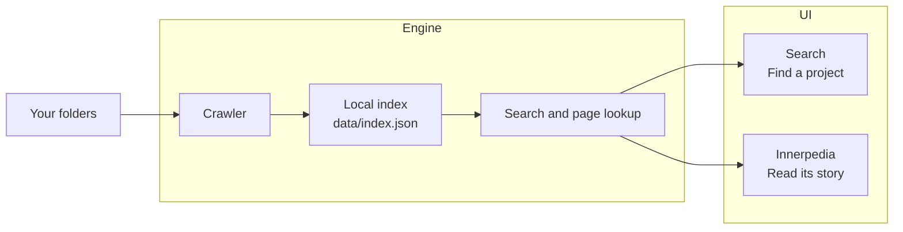

<p align="center">
  
</p>

<h1 align="center"><em>inner</em>net</h1>

<p align="center">
  <strong>A personal internet, made from your folders.</strong><br>
  Search what you have built. Read the encyclopedia of you.<br>
  <sub>Powered by <a href="https://github.com/quirq-ai">quirq</a></sub>
</p>

<p align="center">
  <a href="#get-started">Get started</a> ·
  <a href="docs/engine/README.md">Engine</a> ·
  <a href="docs/ui/README.md">UI</a> ·
  <a href="#contributing">Contributing</a>
</p>

Innernet turns the folders on your machine into a small, connected web. Find a project
by its name, language, framework or README text, then open its **Innerpedia** article
to see what it does, how it is organised and how it has changed.

## Two parts, one personal internet

Your existing folders are the source material. The **engine** turns them into a local
index and answers searches. The **UI** makes that information a place you can explore.

| Part | What it does | Read more |
| --- | --- | --- |
| **Engine** | Crawl folders, build `data/index.json`, resolve articles and categories, and search project context. | [Configuration, search and privacy](docs/engine/README.md) |
| **UI** | A search home, results with knowledge panels, the Innerpedia encyclopedia and an illustrated field guide. | [Pages, design and customization](docs/ui/README.md) |



These are two responsibilities within the same application today. The UI reads the
engine directly on the server; they are not separate packages or services.

## Get started

You need **Node.js 20.9 or newer** and **pnpm**. Run the commands from the repository
directory so the server can find its index.

**1. Install**

```bash
git clone https://github.com/quirq-ai/innernet.git
cd innernet
pnpm install
```

**2. Choose your folders**

Edit [`innernet.config.json`](innernet.config.json) before indexing:

```json
{
  "roots": ["~/Programming"],
  "maxDepth": 6
}
```

Replace `roots` with the folders you want to explore. `maxDepth` controls how many
levels of folders get their own pages. This config currently controls the **engine**.

**3. Index and open**

```bash
pnpm index
pnpm dev
```

Open **[localhost:3470](http://localhost:3470)**, search for a familiar project, or visit
**[Innerpedia](http://localhost:3470/wiki)** and the **[field guide](http://localhost:3470/guide)**.
Both `pnpm dev` and `pnpm start` bind to `127.0.0.1`.

Try `chat lang:ts fw:next` to combine ordinary words with search filters.
Run `pnpm index` again after your folders change; the server loads the new index on
the next request. The first dev run or build fetches fonts, which are then served locally.

The index contains local paths and project text and is gitignored. Innernet serves
on localhost and reads a limited set of project files. See the
[engine privacy notes](docs/engine/README.md#privacy-boundaries) for the exact boundaries.

## Contributing

Start with the [engine README](docs/engine/README.md) for indexing and search work,
or the [UI README](docs/ui/README.md) for pages, branding and interaction work.
Read [CONTRIBUTING.md](CONTRIBUTING.md) for the development loop and PR checklist,
and [DESIGN.md](DESIGN.md) for visual and writing conventions.

Run the required check before opening a PR:

```bash
pnpm -s typecheck
```
