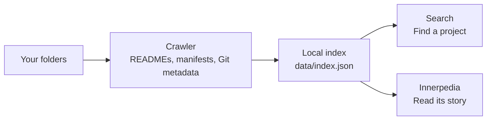

<p align="center">
  
</p>

<h1 align="center"><em>inner</em>net</h1>

<p align="center">
  <strong>A personal internet, made from your folders.</strong><br>
  Search what you have built. Read the encyclopedia of you.<br>
  <sub>Powered by <a href="https://github.com/quirq-ai">quirq</a></sub>
</p>

<p align="center">
  <a href="#get-started">Get started</a> ·
  <a href="#search-your-folders">Search</a> ·
  <a href="#privacy">Privacy</a> ·
  <a href="#contributing">Contributing</a>
</p>

Innernet turns the folders on your machine into a small, connected web. Find a project
by its name, language, framework or README text, then open its **Innerpedia** article
to see what it does, how it is organised and how it has changed.

Your existing folders are the source material. One local JSON index powers both readers.

| Explore | What you will find |
| --- | --- |
| **Search** · `/` and `/search` | A familiar search box, highlighted results, live suggestions, spelling corrections and project knowledge panels. |
| **Innerpedia** · `/wiki` | Project articles with README overviews, folder trees, technology, Git history and related projects. Browse categories, statistics or a random article. |
| **Field guide** · `/guide` | An illustrated walkthrough of the crawl, search and privacy rules, plus an interactive recipe for turning a folder into an article. |

## The public demo (Vercel)

The same app runs as a public demo at https://innernet-nine.vercel.app. Instead of this
machine, it indexes the open-source repositories of github.com/quirq-ai:

```bash
pnpm index:demo   # clone the public quirq-ai repos (anonymous HTTPS) and build data/demo/index.json
pnpm dev:demo     # preview the demo locally
```

`data/demo/index.json` is committed, and every path in it is a GitHub URL. Vercel builds
always run the demo (`VERCEL=1`); locally `INNERNET_DEMO=1` switches it on (`lib/mode.ts`).
In the demo the localhost guard is off, a banner says what you are looking at, folders
link to GitHub instead of VS Code, and the guide plays the committed 720p film.

## How it works



The crawler records folder structure, project descriptions, languages, dependencies and
Git history. Innerpedia assembles articles from that information; folders with less
project context become **stubs**. Shared names get disambiguation pages, and categories
connect projects across your directory tree.

Search runs on the server with MiniSearch. The app uses Next.js, React, TypeScript and
Tailwind CSS, with Markdown rendered by react-markdown and remark-gfm.

## Get started

You need **Node.js 20.9 or newer** and **pnpm**. Run the commands from the repository
directory so the server can find its index.

**1. Install**

```bash
git clone https://github.com/quirq-ai/innernet.git
cd innernet
pnpm install
```

**2. Choose your folders**

Edit [`innernet.config.json`](innernet.config.json) before indexing. The defaults are:

```json
{
  "roots": ["~/Programming"],
  "maxDepth": 6
}
```

Add or replace roots with the folders you want to explore. `maxDepth` controls how many
levels of folders get their own pages.

**3. Index and open**

```bash
pnpm index
pnpm dev
```

Open **[localhost:3470](http://localhost:3470)**, search for a familiar project, or visit
**[Innerpedia](http://localhost:3470/wiki)** and the **[field guide](http://localhost:3470/guide)**.
Both `pnpm dev` and `pnpm start` bind to `127.0.0.1`.

The first dev run or build needs network access to fetch fonts. Afterward, the fonts
are served locally.

### Keep the index fresh

Run `pnpm index` after your folders change. The server picks up the new index on the
next request without a restart.

For a single run, override the configured roots and depth:

```bash
INNERNET_ROOTS="~/projects,~/notes" INNERNET_MAX_DEPTH=3 pnpm index
```

To inspect a trial index without replacing the app's index:

```bash
INNERNET_ROOTS="~/projects" INNERNET_OUT=/tmp/innernet-test.json pnpm index
```

The app always reads `data/index.json` from its working directory; `INNERNET_OUT` only
changes where the crawler writes.

## Search your folders

Start with ordinary words, then narrow the results with operators. Search covers
project names, paths, descriptions, README text, dependencies and agent notes.

| Try | Finds |
| --- | --- |
| `lang:rust` | Folders whose leading languages include Rust. |
| `in:experiments` | Folders inside a matching ancestor folder. |
| `kind:repo` | Git repositories. |
| `fw:next` | Projects using Next.js. |
| `is:article` | Innerpedia articles. |
| `is:stub` | Folders with less project context. |

Combine them with free text, such as `chat lang:ts fw:next`. Quote values containing
spaces, such as `in:"side projects"`. Results can also be filtered using the
**Projects**, **Repositories**, **Documents** and **Folders** tabs.

## Privacy

Innernet is built to read and serve your project context on your machine.

- **Local index.** `data/index.json` contains local paths and project text. It is
  gitignored, and the crawler skips its own `data/`, dependency folders, generated
  folders and symlinks.
- **Limited content reads.** The crawler reads READMEs, `CLAUDE.md` or `AGENTS.md`,
  project manifests and Git metadata. It does not read `.env`, key files or arbitrary
  source and document contents. The Documents tab classifies folders by file names
  and types.
- **Redaction.** Secret-looking file names are hidden, credentials are stripped from
  Git remotes, and credential-shaped text becomes `[redacted]` during indexing and
  when an older index is loaded.
- **Local serving.** The server binds to loopback, rejects non-localhost Host headers
  and sets a Content-Security-Policy that keeps the browser on the same origin.
  Development also allows websockets for hot reload. Suggestions use the app's own
  `/api/suggest` route.

During development, Next.js records request URLs, including search queries, in
`.next/dev/trace`. That file is gitignored and can be deleted.

## Contributing

Read **[CONTRIBUTING.md](CONTRIBUTING.md)** for the development loop and PR checklist,
**[DESIGN.md](DESIGN.md)** for visual and writing conventions, and the
**[field guide](http://localhost:3470/guide)** for an explanation of the app's rules.

Run the required check before opening a PR:

```bash
pnpm -s typecheck
```

<details>
<summary><strong>Explore the source</strong></summary>

| Path | Responsibility |
| --- | --- |
| [`scripts/build-index.ts`](scripts/build-index.ts) | Crawl configured roots and write the index. |
| [`innernet.config.json`](innernet.config.json) | Set roots and maximum depth. |
| `data/index.json` | Local, generated index. Rebuild with `pnpm index`; never commit it. |
| [`lib/search.ts`](lib/search.ts) | MiniSearch, operators, ranking, snippets and suggestions. |
| [`lib/data.ts`](lib/data.ts) | Load the index and resolve articles, stubs, categories and other pages. |
| [`lib/text.ts`](lib/text.ts) · [`lib/normalize.ts`](lib/normalize.ts) | Clean and redact text; bring older indexes up to current rules. |
| [`app/`](app) · [`components/`](components) | Search, Innerpedia and the field guide. |
| [`proxy.ts`](proxy.ts) · [`next.config.ts`](next.config.ts) | Localhost checks and browser security headers. |
| [`scripts/shot.sh`](scripts/shot.sh) | Capture settled app screenshots and report horizontal overflow. |

For UI changes, use the screenshot workflow in [CONTRIBUTING.md](CONTRIBUTING.md)
to check both themes at desktop and phone widths.

</details>
