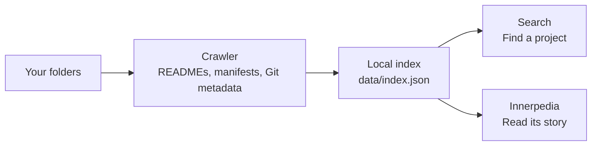

<p align="center">
  
</p>

<h1 align="center"><em>inner</em>net</h1>

<p align="center">
  <strong>A personal internet, made from your folders.</strong><br>
  Search what you have built. Read the encyclopedia of you.<br>
  <sub>Powered by <a href="https://github.com/quirq-ai">quirq</a></sub>
</p>

<p align="center">
  <a href="#get-started">Get started</a> ·
  <a href="#search-your-folders">Search</a> ·
  <a href="#privacy">Privacy</a> ·
  <a href="#contributing">Contributing</a>
</p>

Innernet turns the folders on your machine into a small, connected web. Find a project
by its name, language, framework or README text, then open its **Innerpedia** article
to see what it does, how it is organised and how it has changed.

Your existing folders and, optionally, public GitHub repositories are the
source material. Local JSON indexes power both readers.

| Explore | What you will find |
| --- | --- |
| **Search** · `/` and `/search` | A familiar search box, highlighted results, live suggestions, spelling corrections and project knowledge panels. |
| **Innerpedia** · `/wiki` | Project articles with README overviews, folder trees, technology, Git history and related projects. Browse categories, statistics or a random article. |
| **Agents** · `/search?q=is:agent&t=agents` | The other half of the index: every dot folder an agent or tool keeps (`.claude`, `.codex`, `.cursor`, `.xo`...), each with an article of its instructions, memory, sessions and activity. |
| **Field guide** · `/#guide` | The second half of the home page: an illustrated walkthrough of the crawl, search and privacy rules, an interactive recipe for turning a folder into an article, and a prompt that hands Innernet to an AI assistant. |
| **History** · `/activity` | Every page you opened, one session per browser tab, kept as plain files on this machine with a copy in its own database. The header's arrows step back and forward. |

## The public demo (Vercel)

The same app runs as a public demo at https://innernet-nine.vercel.app. Instead of this
machine, it indexes the open-source repositories of github.com/quirq-ai:

```bash
pnpm index:demo   # clone the public quirq-ai repos (anonymous HTTPS) and build data/demo/index.json
pnpm dev:demo     # preview the demo locally
```

`data/demo/index.json` is committed, and every path in it is a GitHub URL. Vercel builds
always run the demo (`VERCEL=1`); locally `INNERNET_DEMO=1` switches it on (`lib/mode.ts`).
In the demo the localhost guard is off, a banner says what you are looking at, folders
link to GitHub instead of VS Code, and the guide plays the committed 720p film. The demo
may be framed by itself and by the quirq site's launch window (`https://www.quirq.dev`)
and by nothing else, so Vercel preview deployments of that site cannot show it in a
window (allowing them would mean allowing every `*.vercel.app` site). With a
database it keeps the pages and searches visitors open for 30 days, anonymously
([the demo's history](#the-demos-history)); without one, history stays in the browser.

## How it works



The crawler records folder structure, project descriptions, languages, dependencies and
Git history. Innerpedia assembles articles from that information; folders with less
project context become **stubs**. Shared names get disambiguation pages, and categories
connect projects across your directory tree.

Search runs on the server with MiniSearch. The app uses Next.js, React, TypeScript and
Tailwind CSS, with Markdown rendered by react-markdown and remark-gfm.

### Projects and agents

Every page belongs to one of two halves. A folder whose name starts with a dot is an
agent's: `.claude`, `.codex`, `.cursor`, `.agents`, `.xo`, `.openclaw` and the like,
wherever they sit in your sources, together with everything inside them. Everything
else is a project's. The rule lives in `lib/agents.ts`.

Each agent's folder gets an article of its own, an octagon among the circles and
squares: which tool keeps it and which project it belongs to, then **Instructions and
memory** (its `CLAUDE.md`, `AGENTS.md`, `SOUL.md`, `IDENTITY.md`, rules and `memory/`
notes, shown as written) and **Sessions and activity** (how many sessions or transcripts
it keeps and when, from file names, sizes and dates; their contents are never read).
A project's article names the agents that keep folders in it.

Two kinds of dot folder are not agents. Folders a tool generates (`.git`, `.next`,
`.turbo`, `.venv`, `.cache` and similar) are skipped like `node_modules`, and folders
that hold credentials (`.ssh`, `.aws`, `.docker`, `.clerk` and similar) are never
entered. An agent's `worktrees` are checkouts of projects indexed elsewhere, so they
are skipped too.

## Get started

You need **Node.js 20.9 or newer** and **pnpm**. Run the commands from the repository
directory so the server can find its index.

**1. Install**

```bash
git clone https://github.com/quirq-ai/innernet.git
cd innernet
pnpm install
```

**2. Choose your folders**

Edit [`innernet.config.json`](innernet.config.json) before indexing. The defaults are:

```json
{
  "roots": ["~/Programming"],
  "maxDepth": 6
}
```

Add or replace roots with the folders you want to explore. `maxDepth` controls how many
levels of folders get their own pages.

**3. Index and open**

```bash
pnpm index
pnpm dev
```

Open **[localhost:3470](http://localhost:3470)**, search for a familiar project, or visit
**[Innerpedia](http://localhost:3470/wiki)** and the **[field guide](http://localhost:3470/#guide)**.
Both `pnpm dev` and `pnpm start` bind to `127.0.0.1`.

The first dev run or build needs network access to fetch fonts. Afterward, the fonts
are served locally.

### Sources: input, generated data, storage

Open **Sources** next to **Guide** to visit `/sources`, the setup page. It reads top to
bottom, the way data flows, in three numbered sections: what Innernet reads, what it
makes from it, and where the copy is kept.

**I. Input.** Two rows, each with a switch: **Folders on this machine** (the roots in
`innernet.config.json`; **Edit folders** opens it) and **GitHub repositories**, a
collection of public repositories from any account, added one at a time as `owner/name`
or a github.com link, up to 50. There is no whole-account mode, so a sync fetches exactly
what you list; adding the first repository switches it on. Every change saves at once,
to `data/sources.json`. **Sync now** rebuilds what is switched on: the folders with the
same crawler as `pnpm index`, into `data/index.json`; the repositories anonymously into
`.github-cache` and a snapshot of their own, `data/github-<hash>.json`, one per distinct
list, so a changed list never shows another list's pages. Changes and syncs are recorded
in the tab's history; one sync runs at a time. Sources is local only: the public demo
cannot change or sync sources. A command-line rebuild is picked up on the next request.

For a single run, override the configured roots and depth:

```bash
INNERNET_ROOTS="~/projects,~/notes" INNERNET_MAX_DEPTH=3 pnpm index
```

To inspect a trial index without replacing the app's index:

```bash
INNERNET_ROOTS="~/projects" INNERNET_OUT=/tmp/innernet-test.json pnpm index
```

The app reads the selected indexes from its project folder. `INNERNET_OUT` only changes
where the command-line local crawler writes; it does not change the app's index paths.
The local part of **Sync now** always updates `data/index.json`.

**II. Generated data.** One row for everything the input makes, with its path relative
to the app or to your home folder, its size and when it last changed. Hover a row to
copy its path or open its folder; this tab's history file opens in a text editor.

| Data | Path | Notes |
| --- | --- | --- |
| Local index | `data/index.json` | Rebuilt by a Local sync. Pages are rendered from it; there is no HTML file per page. |
| GitHub snapshot | `data/github-<hash>.json` | One per repository list, rebuilt by a Remote sync. |
| History | `~/.innernet/history/` | A folder per tab; other apps can add their own JSONL files. |
| This tab | `~/.innernet/history/<session>/innernet.jsonl` | Edit or remove lines, then reload History. Keep `at`, `app` and `kind`. |
| GitHub clones | `.github-cache/` | Used by sync; safe to delete. |
| This browser | `sessionStorage`, `localStorage` | The tab's session and trail; the theme. |

**III. Storage.** Where the copy of the index and history is kept: **This machine**
(PGlite in `~/.innernet/db`, always in use) and, when you connect one, a **Remote**
database kept in step with it. See [Connect a remote database](#connect-a-remote-database).
It never connects this installation to the hosted demo.

## Search your folders

Start with ordinary words, then narrow the results with operators. Search covers
project names, paths, descriptions, README text, dependencies and agent notes.

| Try | Finds |
| --- | --- |
| `lang:rust` | Folders whose leading languages include Rust. |
| `in:experiments` | Folders inside a matching ancestor folder. |
| `kind:repo` | Git repositories. |
| `fw:next` | Projects using Next.js. |
| `is:article` | Innerpedia articles. |
| `is:stub` | Folders with less project context. |
| `is:agent` | Agents' folders and everything in them. `is:project` finds the rest. |
| `kind:agent` | An agent's own folder: `.claude`, `.codex`, `.xo`... |

Combine them with free text, such as `chat lang:ts fw:next`. Quote values containing
spaces, such as `in:"side projects"`. Results can also be filtered using the
**Projects**, **Agents**, **Repositories**, **Documents** and **Folders** tabs.

## History

Innernet writes down what you open, in plain files on this machine. The files are the
record and the format every app shares, with no index file and no schema registry: a
session is a folder, and each app that takes part writes its own JSON Lines file inside
it. The [database](#the-database) keeps a copy of the lines, read in as they change.

```text
~/.innernet/history/                  set INNERNET_HISTORY_DIR to keep it elsewhere
  2026-10-03T05-12-07Z_k3f9a2/        one folder per browser tab: its start time (UTC) and a short id
    innernet.jsonl                    one JSON object per line, appended by Innernet
    <any-app>.jsonl                   any other app or tool adds its own file
```

Every line is `{"at":"<ISO time>","app":"<name>","kind":"<verb>", ...}` plus whatever
fields the app likes. Innernet writes `visit`, `search`, `back` and `forward`:

```json
{"at":"2026-10-03T05:12:09.512Z","app":"innernet","kind":"visit","url":"/wiki/galileo","title":"galileo"}
{"at":"2026-10-03T05:12:31.020Z","app":"innernet","kind":"search","q":"agent","url":"/search?q=agent"}
```

Reading a session means reading every `*.jsonl` in its folder and sorting by `at`.
App names are lowercase letters, digits, `-` and `_`; lines over 4 KB, lines that are
not JSON and lines without a valid `at` and `kind` are skipped. To add your own
activity, append a line to a file named after your app. This joins the newest session:

```bash
echo '{"at":"'$(date -u +%FT%TZ)'","app":"notes","kind":"edit","file":"todo.md"}' >> "$(ls -d ~/.innernet/history/*/ | tail -1)notes.jsonl"
```

**[/activity](http://localhost:3470/activity)**, the clock in the header, shows the
sessions newest first, each opening onto its events merged across apps. The header's
arrows step back and forward through the pages of the current tab. The browser writes
through the app's own `/api/activity` route, which accepts only same-origin requests
on localhost, and automated browsing visits are not recorded. The route appends the
line to the file first, then reads that session's files into the database; `/activity`
reads in every folder that changed before it shows the list, so a line another app
appended shows on the next visit. Without the database the page reads the files, as it
always has. Delete a session's folder to forget it; the database forgets it on its next
read. The public
demo keeps its visitors' history differently: see [the demo's history](#the-demos-history).

Saving source choices adds a `kind: "sources"` event with the Local and Remote
selections. **Sync now** also adds events to the requesting tab's session: `kind: "sync"`
with `status: "started"`, then `"completed"` or `"failed"`. Completion includes the
page count and elapsed time; failure includes an error message. These events are
written by the server as part of the sync, through the same file-first history store.

## The database

Innernet keeps a copy of what it serves in a small Postgres database. The files stay the
source; the copy means a deleted index does not blank the site, the history page reads
every app's lines with one query, and both can be written back out as files.

On this machine it is [PGlite](https://pglite.dev), Postgres compiled to WebAssembly,
running inside the server on a folder of plain files. Nothing listens on a port and
nothing leaves the machine.

```text
~/.innernet/db/          set INNERNET_DB_DIR to keep it elsewhere, INNERNET_DB=off to go without
  pgdata/                the Postgres cluster (folder mode 700)
  owner.lock             the process that has it open: one at a time
```

| Table | Holds |
| --- | --- |
| `kv` | Small named values: the index's meta and disambiguation, the schema version, and one mark per history file (bytes read so far, inode, mtime, a hash of the bytes before the mark). |
| `pages` | One row per page of the index, in the index's order. |
| `activity` | One row per history line: session, app, time, kind, the event as JSON and the exact line. Its key is a hash of the session, the app and the line, so a line stored twice is one row. |

The server stores each new local `data/index.json` as it loads it, and if that file goes
missing it serves the stored local index instead. GitHub snapshots and the combined
view are kept separate from that database copy. The history comes in as it changes: after each event
the recorder sends, and whenever `/activity` is read. A file whose size, inode and mtime
match its mark is not opened; one that has grown is read from its mark on, new bytes only;
one shortened, edited in place or replaced is read whole, and its rows become exactly its
lines. A line the database will not take is skipped on its own, never holding back the
rest. A session folder or app file you delete is forgotten in the database too. The
history folder itself is different: the database notes which folder it read (its device,
inode and birth time), and if it finds another one there (the folder was lost, moved or
made anew), it keeps every session that did not come with it, however many new ones the
new folder gains, so `pnpm db:load` can write them back. To forget everything at once,
delete `~/.innernet/db` as well.

PGlite runs Postgres single-user, with no autovacuum and no checkpointer, so Innernet
vacuums a table and checkpoints after every few hundred rows rewritten or deleted (a
re-index counts), and keeps the write-ahead log under 64 MB. The folder stays near
70 MB for an index of 5,000 pages, however often it is rebuilt.

One process opens the folder at a time: a second server works from the files alone and
says so once, and the commands below decline politely while the server has it. A lock
left by a server that crashed is taken over, even if its process id has since gone to
another program; with no Innernet running, deleting `owner.lock` is always safe.

```bash
pnpm db:status   # where it lives, its size, what it holds
pnpm db:store    # store data/index.json and bring the history up to date with its folders
pnpm db:load     # write the stored index and history back out as files (stop the server first)
```

`/activity` has a Database card with the same counts and a **Store now** button, which
runs what `db:store` runs inside the server that already holds the folder (a same-origin
POST to `/api/db/store`, on localhost only). `db:load` adds the history lines that are
missing and never deletes any, and it leaves an index file newer than the stored copy
alone unless you pass `--force`.

| Variable | Effect |
| --- | --- |
| `INNERNET_DB_DIR` | Where the database lives (default `~/.innernet/db`). |
| `INNERNET_DB=off` | No database: Innernet reads and writes its files alone. |
| `INNERNET_HISTORY_DIR` | Where the history folders live (default `~/.innernet/history`). |
| `INNERNET_REMOTE` | `on` or `off`, overriding whether the remote database is connected. |
| `INNERNET_REMOTE_DATABASE_URL` | The remote database, overriding `~/.innernet/remote.json`. |
| `INNERNET_HOME` | Where `storage.json` and `remote.json` live (default `~/.innernet`). |

### Connect a remote database

This machine's database is always the one in use. On **Sources**, under **Storage**, you
can connect a remote one beside it, and Innernet keeps the two in step by itself
(`lib/db/remote-sync.ts`):

- **Up**: the local index, whenever it is newer than the remote's, and every history line
  the remote lacks, a few seconds after each new index or page.
- **Down**: every history line the remote holds that this machine lacks, from your other
  machines, written into the history folders (which stay the record) and taken into
  PGlite from there. A machine with no index of its own takes the remote's, and follows
  it from then on.
- **Gone**: history you delete here is deleted there, and never brought back down.
  Nothing else is ever deleted remotely, so one machine never wipes another's history.

**Connect** asks once, in place, naming what leaves the machine: the local index (folder
paths, README text, agent instructions) and the history. It then syncs at once. **Sync
now** syncs on demand, **Test** reaches the database without connecting, and
**Disconnect** stops syncing; what the remote holds stays there until you delete it. A sync
also runs when the server starts, and at most once a minute when the history page is read.

Both settings live outside the project, beside the history, so neither git nor a deploy
carries them: `~/.innernet/storage.json` says whether it is connected
(`{"connected": true}`), and `~/.innernet/remote.json` (mode 600) holds the database's
URL, which is never logged or shown on a page. The remote database here is a Neon
Postgres made for this through the Vercel Marketplace, separate from the demo's and
connected to no Vercel project; any Postgres works, with its URL in `remote.json` or
`INNERNET_REMOTE_DATABASE_URL`. Innernet refuses the demo's database as a remote.

From a terminal, `--remote` works on it directly: `pnpm db:status --remote` says what it
holds, `pnpm db:store --remote` syncs once, both ways, and on a new machine with the same
`remote.json`, `pnpm db:load --remote` writes the stored index and history out as files.

### The demo's database

The public demo uses [Neon](https://neon.tech) serverless Postgres instead, in US East,
through the `DATABASE_URL` that the Vercel Marketplace sets. Local mode never connects to
it, whatever is set; your own remote database (above) is a different one. It holds two things.

**The demo index.** On first use, then at most every five minutes, the demo looks for an
index newer than the bundled `data/demo/index.json` and serves it once it passes the same
leak checks as `pnpm index:demo`. The server never writes it. To store a fresh one, with
the connection string in the environment (the maintainers keep it in the gitignored
`.env.neon.local`, which Next.js never loads):

```bash
pnpm index:demo
set -a; . ./.env.neon.local; set +a; pnpm db:store --demo
```

`db:store --demo` refuses a local index, and anything that names this machine, before a
byte reaches Neon; the store itself refuses the same again, whoever calls it. Without
`--demo` the commands drop `DATABASE_URL` from their environment and refuse to run while
`INNERNET_DEMO`, `INNERNET_DEMO_BUILD` or `VERCEL` is set, so a shell left in demo mode
cannot send this machine's index anywhere.

A build that can see `DATABASE_URL` turns off Turbopack's persistent cache
(`next.config.ts`): that cache saves the whole environment of the build in `.next/cache`,
in files anyone on the machine can read, and the connection string belongs only in
`.env.neon.local`.

### The demo's history

The recorder keeps each visitor's events in their browser's `localStorage`, and when the
demo has a database it also posts them to `/api/activity`, which keeps them in the same
`activity` table for 30 days:

- **What is stored:** per event, the kind (`visit`, `search`, `back` or `forward`), the
  page's path on the demo (one of its own pages, with no query but the search's own `q`,
  `t` and `p`: campaign tags and other sites' click ids are dropped in the browser and
  again on the server), its title or the search words, `via` (whether the header's
  buttons or the browser's moved you back or forward), and the server's time. Each event
  is kept once, as JSON.
- **Under what:** each tab makes a session id from the time it opened, by the visitor's
  own clock, and 12 random characters. The database keeps only a SHA-256 hash of it,
  which cannot be turned back into the id or the time.
- **What is never stored:** an IP address, a user agent, cookies or any other header.
  Nothing on the site lists sessions: the history page asks for its own sessions by the
  ids its browser remembers, in the body of a `POST` (`{"read": [ids]}`, at most 50), so
  only a browser holding an id can read it back, and ids never appear in an address that
  a request log would keep. The people who run the demo can read the database, as with
  any server, and Vercel keeps its usual request logs for any site it serves.
- **For how long:** 30 days. Older rows are never served, and every write deletes a few
  of them first.
- **How much:** at most 400 events a session, and 10,000 stored a day across the demo,
  counted as they are stored (deleting a session gives none back); nothing more once the
  table reaches 300 MB. A read returns at most 1,000 events, and once the demo has served
  50,000 in a day it serves none until the next. Past any of these the route answers 429
  (or, for reads, returns the counts without the events) and the browser keeps its own
  copy.
- **How to clear it:** the Clear button on `/activity` deletes, from the database and
  from the browser, every session this browser sent in the last 30 days
  (`DELETE /api/activity` with `{"sessions": [ids]}`); the browser remembers up to a
  thousand of them.

The route takes little: same origin only (its Origin must name its Host, and
`Sec-Fetch-Site` must say `same-origin` when present), JSON under 2 KB, one of those four
kinds, one of the demo's own pages, short printable text and a session id of the demo
recorder's exact shape. Without `DATABASE_URL`, as on a fork, the demo stores nothing:
`/api/activity` answers 404 and the history stays in the browser alone. A rate limit by
address, which the app cannot keep without keeping addresses, belongs in the Vercel
Firewall (a rate-limit rule on `/api/activity`).

## Privacy

Innernet is built to read and serve your project context on your machine.

- **Local index.** `data/index.json` contains local paths and project text. It is
  gitignored, and the crawler skips its own `data/`, dependency folders, generated
  folders and symlinks.
- **Limited content reads.** The crawler reads READMEs, `CLAUDE.md` or `AGENTS.md`,
  project manifests and Git metadata, plus a repository's or project's own logo image,
  found by name (`logo`, `icon`, `mark`, `favicon` and the like, up to 64 KB for SVG
  and 96 KB for other images) under the same secret-folder and secret-name rules, with
  symlinks never followed. In an agent's own dot folder it also reads instruction and
  memory files (`CLAUDE.md`, `AGENTS.md`, `SOUL.md`, rules, `memory/` notes; the first
  8,000 characters of each, ten files at most, redacted like a README), and it counts
  session and log files by name, size and date without opening them. It does not read
  `.env`, key files, settings files or arbitrary source and document contents. Dot
  folders that hold credentials (`.ssh`, `.aws`, `.clerk`...) are never entered. The
  Documents tab classifies folders by file names and types.
- **Local database.** By default the copy is in `~/.innernet/db` (PGlite, folder mode
  700) and stays on this machine. It follows the history folders: a session you delete
  there is forgotten in the database too. Only a history folder lost or replaced whole
  has its sessions kept, for `pnpm db:load`.
- **A remote database, only when you connect one.** Connecting on Sources, after a
  confirmation, copies the local index (folder paths, README text, agent instructions)
  and the history to your own remote database, keeps it in step, and brings your other
  machines' history down, until you disconnect. Its URL stays in
  `~/.innernet/remote.json` (mode 600) and never reaches a page or a log; the demo's
  database is refused as a remote.
- **Remote sources.** Remote sync makes anonymous HTTPS requests to GitHub for the
  public repositories you list. Their snapshot and clones stay in this project; local
  folder contents, activity and the database are not uploaded by a sync.
- **Redaction.** Secret-looking file names are hidden, credentials are stripped from
  Git remotes, and credential-shaped text becomes `[redacted]` during indexing and
  when an older index is loaded.
- **Local serving.** The server binds to loopback, rejects non-localhost Host headers
  and sets a Content-Security-Policy that keeps the browser on the same origin and
  refuses to let any other page frame it (`X-Frame-Options: DENY` as well).
  Development also allows websockets for hot reload. Browser requests stay on the
  app's own routes: `/api/suggest` for suggestions, `/api/activity` to write the
  [history](#history), and the local **Sources** page's `/api/sources`,
  `/api/sources/sync` and `/api/sources/open`. These source routes and history writes
  accept same-origin requests on localhost only. Opening or editing a storage location
  uses a named app location, never an arbitrary path supplied by the browser. The
  history page's Store now posts to `/api/db/store`, on localhost only.
- **The public demo.** It reads nothing from the machine it runs on. With a database it
  keeps the pages and searches its visitors open for 30 days, anonymously, as described in
  [the demo's history](#the-demos-history): no IP address, user agent or cookie, only a
  hash of each tab's id, nothing that lists sessions, and a Clear button that deletes
  them. Its database also holds the
  public demo index, checked before it is stored and again before it is served. Without
  a database it sends nothing to `/api/activity` (that answers 404) and keeps each
  visitor's history in their own `localStorage`.

During development, Next.js records request URLs, including search queries, in
`.next/dev/trace`. That file is gitignored and can be deleted.

## Contributing

Read **[CONTRIBUTING.md](CONTRIBUTING.md)** for the development loop and PR checklist,
**[DESIGN.md](DESIGN.md)** for visual and writing conventions, and the
**[field guide](http://localhost:3470/#guide)** for an explanation of the app's rules.

Run the required check before opening a PR:

```bash
pnpm -s typecheck
```

<details>
<summary><strong>Explore the source</strong></summary>

| Path | Responsibility |
| --- | --- |
| [`scripts/build-index.ts`](scripts/build-index.ts) | Crawl configured roots and write the index. |
| [`innernet.config.json`](innernet.config.json) | Set roots and maximum depth. |
| `data/index.json` | Local, generated index. Rebuild with `pnpm index`; never commit it. |
| `data/sources.json` · `data/github*.json` · `.github-cache/` | Saved source choices and remote configuration, public GitHub snapshots and disposable remote clones. All local and gitignored. |
| [`lib/sources.ts`](lib/sources.ts) · [`lib/source-storage.ts`](lib/source-storage.ts) · [`lib/remote-config.ts`](lib/remote-config.ts) · [`lib/storage.ts`](lib/storage.ts) · [`lib/db/remote-sync.ts`](lib/db/remote-sync.ts) | Source selection and the repository collection, the generated data Sources lists, and the remote database: its settings and the sync that keeps it in step. |
| [`lib/search.ts`](lib/search.ts) | MiniSearch, operators, ranking, snippets and suggestions. |
| [`lib/data.ts`](lib/data.ts) | Load the index and resolve articles, stubs, categories and other pages. |
| [`lib/text.ts`](lib/text.ts) · [`lib/normalize.ts`](lib/normalize.ts) | Clean and redact text; bring older indexes up to current rules. |
| [`lib/logo.ts`](lib/logo.ts) | Serve each project's logo from the index at `/api/logo/<hash>`, so pages link to it instead of inlining it. |
| [`lib/activity.ts`](lib/activity.ts) | Read and append the history: one folder per session, one JSON Lines file per app. |
| [`lib/db/`](lib/db) | The database: PGlite on this machine, Neon on the demo, one adapter and the same SQL for both. `ingest.ts` keeps this machine's history in step with its folders; `demo-history.ts` keeps the demo visitors' history. |
| [`scripts/db.ts`](scripts/db.ts) · [`lib/demo-check.ts`](lib/demo-check.ts) | `pnpm db:status`, `db:store` and `db:load`; the demo's leak checks. |
| [`app/`](app) · [`components/`](components) | Search, Innerpedia, the field guide and the history. `app/api/activity` writes the history; `app/api/db/store` is Store now; `app/api/sources` inspects and saves source choices, `sources/sync` refreshes them, `sources/open` opens named locations, and `app/api/storage` connects, syncs and disconnects the remote database. |
| [`proxy.ts`](proxy.ts) · [`next.config.ts`](next.config.ts) | Localhost checks and browser security headers. |
| [`scripts/shot.sh`](scripts/shot.sh) | Capture settled app screenshots and report horizontal overflow. |

For UI changes, use the screenshot workflow in [CONTRIBUTING.md](CONTRIBUTING.md)
to check both themes at desktop and phone widths.

</details>
