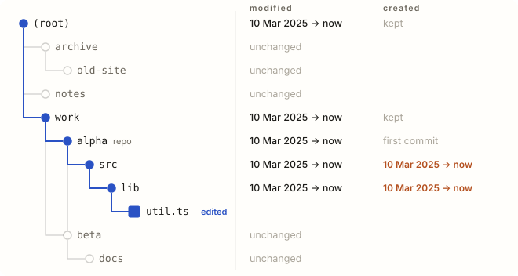
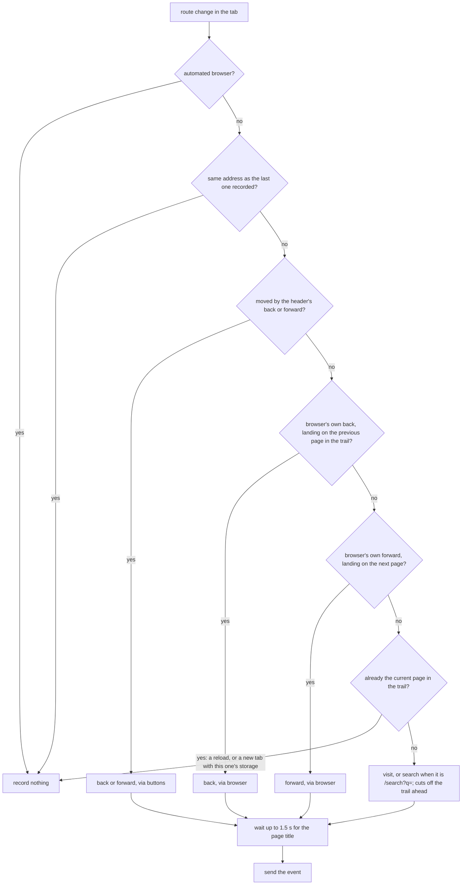
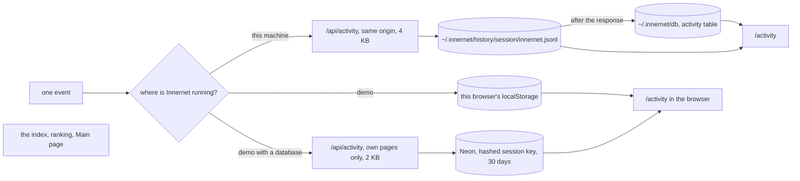
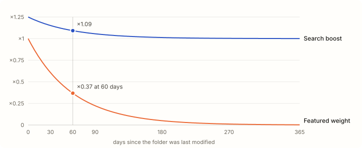

# How *activity* reaches the index

*The third companion to the [architecture document](architecture.md) and the [data inventory](data.md). Read from the code at commit 4e9bece and tested on a scratch folder tree, 3 October 2026. First written against 735c5be; the experiment was re-run on the new code.*

> **Snapshot of commit 4e9bece (3 October 2026).** `main` has since merged #32, #34 and #35. Going by their commit messages, they change parts of this document, which has not yet been updated for them:
>
> - **Agents (#34):** dot folders such as `.claude`, `.codex` and `.cursor` are now indexed as agents. Their instruction and memory files (`CLAUDE.md`, `AGENTS.md`, `SOUL.md`, rules, `memory/`) are read, redacted and capped at 8,000 characters each, so statements here that dot folders are never read no longer hold for them.
> - **Sources (#32, #35):** a `/sources` page manages local folders and up to 50 public GitHub repositories from any account, each crawled into its own `data/github-<hash>.json` snapshot.
> - **Remote database (#35):** a Neon database of your own can be connected beside the local PGlite and is kept in step both ways, index and history. Statements here that nothing leaves this machine hold only while no remote database is connected.
> - New modules (`lib/sources.ts`, `lib/storage.ts`, `lib/agents.ts`, `lib/merge-indexes.ts`, `lib/db/remote-sync.ts`, `lib/db/tombstones.ts` and others) are not in the figures, and every line number refers to 4e9bece.

Activity now means two separate things in Innernet. **Work on disk** reaches the index once per `pnpm index`, from file modification times, git author dates and the shape of the tree. Those become `created`, `modified` and a git history on every page, which drive Recently touched, In the news, the featured article, the search ranking and every "updated 3 days ago".

**Browsing** is new. Since the latest pushes, every page you open in Innernet is recorded as a history event in `~/.innernet/history` and copied into a local database. That history powers the `/activity` page and the header's back and forward buttons. It never feeds back into the index, the ranking or the Main page.

To see what each kind of disk activity does, I built a small tree with a git repository, indexed it, did eleven ordinary things to it one at a time, and diffed the index after each. I ran the whole experiment again on the new crawler: the date and slug rules did not change, and every result held.

| activity | |
|---|---|
| Disk signals | File mtimes, git author dates, tree shape |
| Stored as | created · modified · git |
| Rolls up | To every ancestor folder |
| Ignored | Dot files, dependency and build folders, git internals |
| **Browsing New** |  |
| Recorded | Every page opened: visit, search, back, forward |
| Kept in | ~/.innernet/history · ~/.innernet/db |
| Affects index | Never |
| **Refresh** |  |
| Trigger | `pnpm index`, by hand |
| Picked up | On the next request, then copied to the database |
| **Clocks** |  |
| Index time | Main page choices, History window |
| Wall clock | "3 days ago" labels, search boost |

## What changed since 735c5be

| Change | Effect on activity |
|---|---|
| Browsing history (391f1de) | A recorder on every page writes one event per page opened. "Using Innernet changes nothing", as this page used to say, is no longer true: it writes history, though never to the index. |
| Database (4e9bece) | Each new index is copied to `~/.innernet/db` when the server loads it; history lines are read in after every event. A deleted index file is replaced by the stored copy, so the app keeps showing activity as of the last index stored. |
| Logos (391f1de) | Adding a logo file to a project is now activity: the page gains a `logo`, and the Innerpedia globe ranks it higher. |
| Crawler date and slug rules | Unchanged. The 11-step experiment gave the same results on 4e9bece, with one timing difference in step 2. |

## Findings at a glance

All re-run on 4e9bece. None was fixed by the two pushes.

| Severity | Finding | Where | Status on 4e9bece |
|---|---|---|---|
| **Medium** | [Cloning, switching branches or copying counts as fresh work](#a1) | scripts/build-index.ts:903 | Still open, reproduced |
| **Low** | [Editing one file can make its folder younger](#a2) | scripts/build-index.ts:905 | Still open, reproduced |
| **Low** | [A new folder with an existing name renames the old one](#a3) | scripts/build-index.ts:946 | Still open, reproduced |
| **Low** | [In the demo, busy repositories stop counting at 300 commits](#a4) | scripts/build-demo-index.ts:39 | Still open; `xo-space` at 272 |
| **Note** | [Two clocks: the Main page stops at index time, labels keep moving](#a5) | components/wiki/main/insights.ts:26 | Still open |

## What counts as activity

| Signal | Read from | Feeds | Code |
|---|---|---|---|
| File modification time | `stat().mtimeMs` of every non-dot file in a folder's subtree | `modified`: the latest one | build-index.ts:777-784, 903 |
| File birth time | `stat().birthtimeMs` | `created`: the earliest birth, or the latest mtime if older | build-index.ts:905 |
| Git author dates | `git log --no-merges`, root commits, `rev-list --count` | `git.*`; a repository's dates widen to its first and last commit | build-index.ts:180-226, 870-871 |
| Tree shape | Which folders exist, their names, README, manifest, agent notes, logo files | Pages, slugs, kind, categories, See also, `logo` | build-index.ts:908-1086 |
| Browsing **New** | Route changes in your browser, recorded by `components/activity/recorder.tsx` | History files and the database; `/activity`; back and forward. Never the index. | recorder.tsx:41-105 |

**Not activity for the index:** dot files and folders, anything inside `node_modules`, `dist`, `build` and the other pruned folders, git operations that make no commit, and browsing.

## One edit, five pages

Step 1 of the experiment, identical on 4e9bece: one line changed in `work/alpha/src/lib/util.ts`, no commit, then `pnpm index`.

*Fig. 1 `modified` climbs the whole chain to the root. Recently touched and In the news compensate by skipping a container that shares its timestamp with a project inside it (`components/home/recently-touched.tsx:12-25`, `components/wiki/main/insights.ts:263`). The orange `created` jumps on `src` and `lib` are [A2](#a2).*

## Every activity, tested

"Step" points to the experiment log; "code" means read from the code rather than run.

| Activity | What changes in the index | What you see | Evidence |
|---|---|---|---|
| **Working on files** |  |  |  |
| Edit and save a file | `modified` on its folder and every ancestor; `created` can move forward (A2) | Recently touched, In the news, "updated just now", full search boost | Step 1 |
| Install dependencies | `node_modules` ignored except its name; the lockfile moves `modified` and counts as JSON | Looks like work | Step 4 |
| Edit `.env` or another dot file | Nothing | Nothing | Step 3 |
| Copy a folder (`cp -r`) | A new page dated now | "started just now" if it is an article | Step 7 |
| Copy keeping times (`cp -a`, unzip) | Old dates kept, until the first edit inside (A2) | Correct dates at first | Step 7 |
| Add a logo file **New** | A repository or project gains `logo` and `logoSurface`; the file's mtime also moves `modified` | Its own mark on every sigil; a higher place on the globe (score ×1.25 + 0.25) | Code: build-index.ts:919-926, insights.ts:224 |
| The same icon in 4+ unrelated projects **New** | The shared logo is dropped from all of them | Letter sigils instead | Code: build-index.ts:671-687 |
| **Git** |  |  |  |
| Commit | `git.*`; `modified` up the chain when the commit is newer than the files | History section, infobox, a quoted commit in In the news | Step 2 |
| Amend, rebase, cherry-pick | Hash and subject in `recent`; author dates stay | Not new activity | Step 10 |
| Fetch, gc, tag | Nothing | Nothing | Step 3 |
| Switch branch, check out, pull | Rewritten files get new mtimes and birth times (A1, A2) | A day of work with no new commit | Step 11 |
| Clone a repository | The repository dates from its first commit; `modified` and subfolders are the clone time (A1) | "updated just now" | Step 7 |
| **Shape of the tree** |  |  |  |
| README passes 25 words | A stub becomes a project and an article | A new article | Step 5 |
| Add a manifest or CLAUDE.md | Becomes a project and an article; folders inside get `partOf` | Sub-projects fold under it | Code: build-index.ts:911-916, 1006-1022 |
| A third article in one folder | The folder becomes a collection category for every article inside | Siblings change without being touched | Step 7 |
| Add a folder with an existing name | Existing pages get qualified slugs (A3) | Old links land on a list | Steps 6, 7 |
| Rename or move; delete | A new page and slug; the old one is gone | The old URL is a 404 | Steps 8, 9 |
| **Without touching your folders** |  |  |  |
| Time passes, no re-index | Nothing | Labels age; the search boost fades; the Main page stays (A5) | Code |
| Delete `data/index.json` **New** | Nothing new: the server serves the copy in `~/.innernet/db` | Activity as of the last index stored | Code: lib/data.ts:105-107; tested |
| Open pages in Innernet **Changed** | Nothing in the index. One history event per page, in the files and the database | `/activity`, back and forward | Code: recorder.tsx, app/api/activity/route.ts |
| Another app writes a `.jsonl` **New** | Nothing in the index; its lines join that session in the database | Its events in `/activity`, under its name | Code: lib/db/ingest.ts:16-42 |

**Review**

#### A1. Cloning, switching branches or copying counts as fresh work

*Medium · Still open*

- **Where:** `scripts/build-index.ts:903` takes `modified` from the newest file mtime; for a repository, `:870-871` can only push it later with the last commit.
- **Why:** Clone, checkout, pull, branch switches, unzipping, a formatter run or a lockfile rewrite all set mtimes to now. The folder and every ancestor read "updated just now", enter Recently touched and In the news, and take the full search boost. The demo indexer dates folders from git history instead (`scripts/build-demo-index.ts:190-226`).
- **Evidence:** Re-run on 4e9bece. Step 7: a fresh clone had `modified` at clone time, after its last commit. Step 11: switching to a branch and back, with no commit, set `modified` to now on five pages.
- **Fix:** For a repository with a clean working tree, date folders from git the way the demo does; keep mtimes for untracked and uncommitted files.

#### A2. Editing one file can make its folder younger

*Low · Still open*

- **Where:** `scripts/build-index.ts:905`: `created = min(earliest birth, latest mtime)`.
- **Why:** The rule trusts an old mtime only while every file keeps one. The first edit raises the latest mtime and `created` jumps forward to the copy date; editors that save by writing a new file, and branch switches, do the same.
- **Evidence:** Re-run on 4e9bece. Step 1 moved `created` on `src` and `lib` from 10 March 2025 to the day the files were placed; step 11 moved `lib` again.
- **Fix:** Track the earliest mtime too and use `min(earliest birth, earliest mtime)`.

## Browsing history **New**

One session per browser tab. A route change becomes at most one event, named by comparing the new address with the tab's own trail of pages.

*Fig. 3 How the recorder names an event (`components/activity/recorder.tsx:41-105`). The trail is the tab's stack of up to 100 pages in `sessionStorage` (`components/activity/trail.ts:30-114`); the header's back and forward buttons move along it.*

*Fig. 4 Where an event goes. The last box stands alone on purpose: nothing reads history back into the index, the ranking or the Main page. On this machine the files are the record and the database follows them; delete a session folder and the database forgets it on its next pass.*

| Event | Fields | When |
|---|---|---|
| visit | `at`, `url`, `title` | Any page opened that is not a search or a step along the trail |
| search | `at`, `url`, `q` | A results page; the search words up to 300 characters (120 on the demo) |
| back, forward | `at`, `url`, `title`, `via` | A step along the trail, with the header's buttons or the browser's own |

## Where activity shows

Every screen that reads activity, which kind, and which clock it measures against.

| Screen | Rule | Clock | Code |
|---|---|---|---|
| Home · Recently touched | Up to 8 articles outside any project, newest `modified` first, skipping a folder that shares its timestamp with one inside it | *wall* | home/recently-touched.tsx:12 |
| Search ranking | Score × (1 + 0.25·e^(−days/60)) on `modified` | *wall* | lib/search.ts:183-186 |
| Result chips, knowledge panel | "updated 3 days ago", Created month, Last touched | *wall* | search/result-item.tsx:63 |
| Article lead and infobox | "Created in March 2025, it was last touched 3 days ago"; Created, Last touched, Commits | *wall* | wiki/article/lead.ts:324-333 |
| History section | 24 monthly bars ending at the index month | *index* | wiki/article/history.tsx:26 |
| Main page · Featured, In the news, Did you know, On this day | Recency at index time; news quotes a commit within 3 days of `modified` | *index* | wiki/main/insights.ts:189-301, 315-441 |
| Main page · globe **New** | Up to 96 tiles by substance (README words, files, commits), ×1.25 + 0.25 with a logo; no recency | *none* | wiki/main/insights.ts:208-244 |
| Statistics | Busiest repositories; commits per month across distinct histories | *index* | wiki/main/insights.ts:360-382 |
| /activity **New** | Browsing sessions newest first, every app's events merged by time | *wall* | app/activity/page.tsx:48-58 |
| Header back and forward **New** | The tab's own trail | *none* | components/activity/history-nav.tsx |
| Footers | "Indexed 2 hours ago" | *wall* | site-footer.tsx:42 |

**Review**

#### A5. Two clocks: the Main page stops at index time, labels keep moving

*Note · Still open*

- **Where:** Main page choices use `indexTime()` (`components/wiki/main/insights.ts:26-29`); labels use `timeAgo()` against `Date.now()` (`lib/format.ts:25`), and so does the search boost (`lib/search.ts:183-186`).
- **Why:** An index left alone for a month still shows last month's news, labelled "5 weeks ago", while search quietly stops favouring recent work. The database fallback stretches this: delete the file and the stored copy keeps serving, with the same frozen picks. The footer's "Indexed N ago" is the only cue.
- **Fix:** Show a notice when the index is more than a few days old, with the `pnpm index` hint.

## How recency is weighted

Unchanged. Two places turn "how long ago" into a number, both with a 60-day time constant (`lib/search.ts:183-186`, `components/wiki/main/insights.ts:189-206`).

**Blue:** search boost, 1 + 0.25·e^(−days/60). **Orange:** featured weight, e^(−days/60).

*Fig. 2 Multipliers applied to a page's score. Search measures days from now; the featured article measures from index time. The new globe uses neither.*

| Days since last modified | 0 | 7 | 30 | 60 | 90 | 180 | 365 |
|---|---|---|---|---|---|---|---|
| Search boost | ×1.25 | ×1.22 | ×1.15 | ×1.09 | ×1.06 | ×1.01 | ×1.00 |
| Featured weight | ×1.00 | ×0.89 | ×0.61 | ×0.37 | ×0.22 | ×0.05 | ×0.00 |

## Git activity

Unchanged since 735c5be (`scripts/build-index.ts:180-226`).

| Field | From | Window or cap |
|---|---|---|
| commitCount | `git rev-list --count --no-merges HEAD` | The checked-out branch, merges excluded |
| firstCommit | Earliest root commit | In a shallow clone, the shallow boundary (A4) |
| lastCommit, recent | Author dates of the newest commits | 15 recent |
| authors, authorCount | Names in the 6,000 newest commits | Top 8 listed |
| monthly, onThisDay | Commits per month; commits on the index date in earlier years | 24 months; 10 commits; frozen at index time |

## Structure changes

Slugs, categories and See also are worked out across the whole tree, so a change in one place can rewrite pages you never touched. Re-run on 4e9bece with the same results.

| Step | What happened on disk | Slugs before → after |
|---|---|---|
| 6 | Created `archive/notes` | `notes` → `notes_(root)`; `/wiki/notes` became a list of both |
| 7 | Cloned `alpha` next to itself | `src` → `src_(alpha)`, `lib` → `lib_(src)`; `alpha` and `beta` gained the category "work" |
| 8 | Renamed `beta` to `gamma` | `beta` and its `docs` gone, `gamma` and `docs` new; `/wiki/beta` is a 404 |
| 9 | Deleted `archive/notes` | `notes_(root)` → `notes` again |

**Review**

#### A3. A new folder with an existing name renames the old one

*Low · Still open*

- **Where:** `scripts/build-index.ts:946-1004`, unchanged: the bare slug goes only to a clear primary topic.
- **Why:** Bookmarks and links kept elsewhere move to a disambiguation list. They do not break (`lib/data.ts:176-177`). The new history makes this easier to see: an old `visit` event links to a slug that may now name a list.
- **Fix:** Keep the previous index's slugs and redirect a slug that now names a list to the page it used to name. The database now holds the previous index, which makes this cheap.

## Between index runs

Nothing watches your folders and nothing re-indexes on a schedule. Disk activity reaches Innernet only when someone runs `pnpm index`. The server notices the new file on the next request, re-reads it, rebuilds its search engine and Main page facts, and copies the index into `~/.innernet/db` in the background.

Until then the index describes the moment it was written. Labels measured against the wall clock keep moving; the featured article, In the news, On this day and the History window stay where they were. If `data/index.json` is deleted, the stored copy serves, frozen at the same moment.

Browsing is the opposite: it is recorded at once, page by page, and read into the database after each event. It shows on `/activity` straight away and changes nothing else.

## Activity in the demo

In the demo, disk activity means commits pushed to the public quirq-ai repositories, followed by `pnpm index:demo`, a commit and a deploy, or by `pnpm db:store --demo`, which lets the running demo pick up a newer index from Neon within five minutes, without a deploy. Folder dates come from git history, so A1 and A2 do not apply.

Browsing on the demo is recorded in the visitor's browser, and in Neon for 30 days when the demo has a database, under a hashed session key with the server's time.

#### A4. Busy repositories stop counting at 300 commits and look younger as they grow

*Low · Still open*

- **Where:** `scripts/build-demo-index.ts:39` clones with `--depth 300`; the crawler counts commits and finds the first one inside that shallow clone (`scripts/build-index.ts:186-188`).
- **Why:** Past 300 commits, `commitCount` stops growing and `created` moves forward with every new commit. `xo-space` is at 272 commits in the rebuilt demo index.
- **Evidence:** A repository with 10 monthly commits, cloned with `--depth 3`: count 3, first commit 1 August 2025 instead of January.
- **Fix:** The clones are blobless already, so drop `--depth` or use `--shallow-since`.

## Keeping it accurate

| To | Do |
|---|---|
| See today's work | Run `pnpm index`, by hand or on a schedule; the server needs no restart and copies it to the database itself |
| Keep clones and checkouts from looking like work | The A1 fix |
| Keep "created" stable | The A2 fix |
| Keep links stable | The A3 redirect, now cheap with the previous index in the database |
| Count full history in the demo | The A4 fix |
| Notice a stale index | The footer, or the A5 notice |
| Forget browsing | Delete a session folder in `~/.innernet/history`; delete `~/.innernet/db` as well to forget everything at once. On the demo, Clear on `/activity`. |

## Experiment log

The same scratch tree as before, rebuilt and run again on 4e9bece: `work/alpha` (a git repository with three dated commits), `work/beta`, `archive/old-site` and `notes`. After each step, `pnpm index` to a scratch file and a field-by-field diff. Nothing was committed.

| Step | Action | Changed | Added | Removed | vs 735c5be |
|---|---|---|---|---|---|
| 1 | Edit `src/lib/util.ts` | 5 | 0 | 0 | Same |
| 2 | Commit it | 3 | 0 | 0 | Was 1: this commit landed a second after the edit, so its newer date rolled up to `work` and the root |
| 3 | Write `.env`; `git gc`; `git tag` | 0 | 0 | 0 | Same |
| 4 | `node_modules` and a lockfile | 3 | 0 | 0 | Same |
| 5 | Grow a README from 21 to 40 words | 3 | 0 | 0 | Same |
| 6 | Create `archive/notes` | 3 | 1 | 0 | Same |
| 7 | `cp -r`, `cp -a`, `git clone` | 6 | 5 | 0 | Same |
| 8 | Rename `beta` to `gamma` | 3 | 2 | 2 | Same |
| 9 | Delete `archive/notes` | 3 | 0 | 1 | Same |
| 10 | `git commit --amend` | 1 | 0 | 0 | Same |
| 11 | Check out a branch and back | 5 | 0 | 0 | Same |

**Also tested on 4e9bece:** a database stored from a good index served it, from the first call, once `data/index.json` was deleted. **Not tested:** the recorder in a real browser (its logic is read from the code), and logo detection on a real project tree.

*Every number on this page came from the code at commit 4e9bece, the committed demo index, or the experiment above. First written at 735c5be.*
