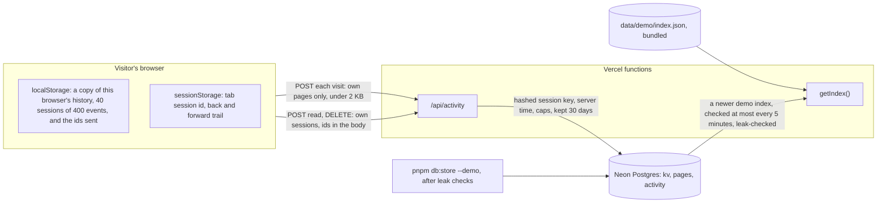
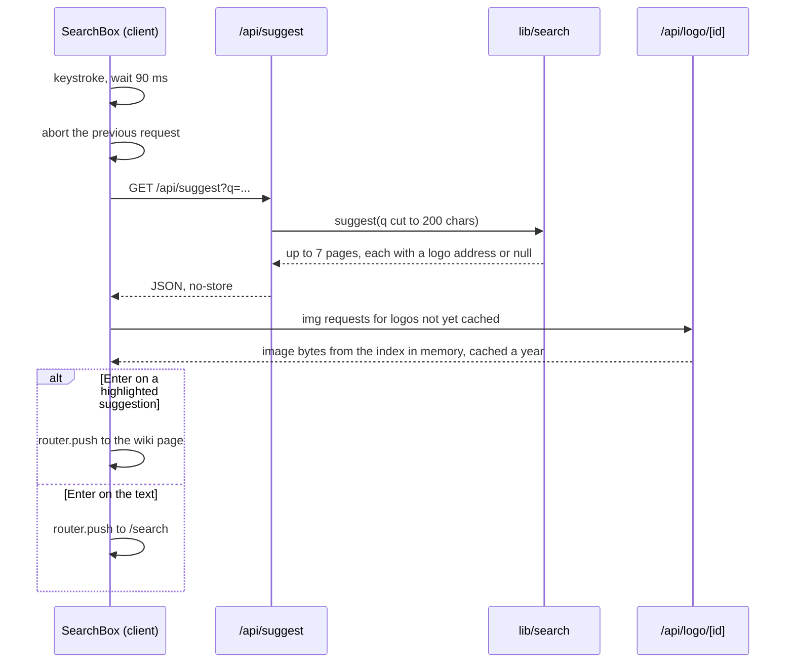
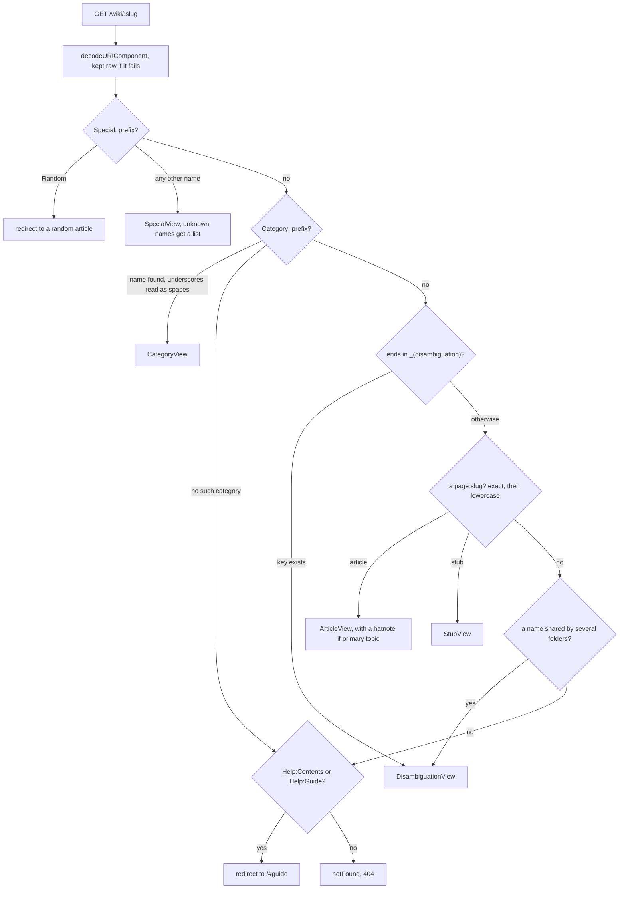
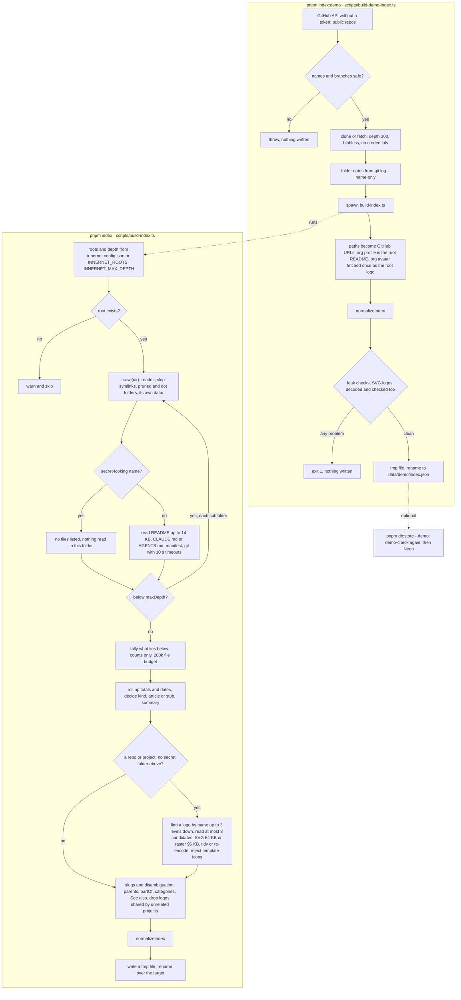
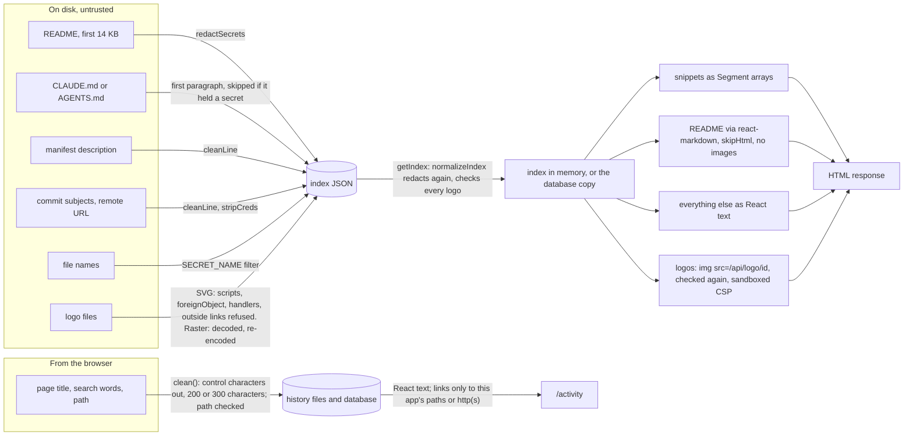

# *Inner*net architecture

*A technical architecture document for quirq-ai/innernet, read from the code at commit 4e9bece on 3 October 2026. First written against 735c5be; updated after two pushes added a database, a browsing history, project logos and the Innerpedia globe.*

> **Snapshot of commit 4e9bece (3 October 2026).** `main` has since merged #32, #34 and #35. Going by their commit messages, they change parts of this document, which has not yet been updated for them:
>
> - **Agents (#34):** dot folders such as `.claude`, `.codex` and `.cursor` are now indexed as agents. Their instruction and memory files (`CLAUDE.md`, `AGENTS.md`, `SOUL.md`, rules, `memory/`) are read, redacted and capped at 8,000 characters each, so statements here that dot folders are never read no longer hold for them.
> - **Sources (#32, #35):** a `/sources` page manages local folders and up to 50 public GitHub repositories from any account, each crawled into its own `data/github-<hash>.json` snapshot.
> - **Remote database (#35):** a Neon database of your own can be connected beside the local PGlite and is kept in step both ways, index and history. Statements here that nothing leaves this machine hold only while no remote database is connected.
> - New modules (`lib/sources.ts`, `lib/storage.ts`, `lib/agents.ts`, `lib/merge-indexes.ts`, `lib/db/remote-sync.ts`, `lib/db/tombstones.ts` and others) are not in the figures, and every line number refers to 4e9bece.

**Innernet** is a TypeScript Next.js application that turns the folders on one machine into a search engine and an encyclopedia, Innerpedia. An offline crawler writes one JSON index; a Next.js server reads that file, holds it in memory, and renders every page on the server. Since the latest pushes it also keeps a **browsing history**, as plain JSON Lines files, and a **copy of everything in an embedded Postgres** (PGlite) that lives in a folder beside the history. Nothing on this machine talks to an outside service at run time.

The same code runs as a public demo on Vercel. There the index holds the open-source repositories of quirq-ai, ships with every server function, and can be replaced by a newer one held in a Neon Postgres database, which also keeps visitors' history for 30 days when it is configured.

Four properties shape the codebase now:

- **The index file is still the source.** The crawler writes `data/index.json`; the database keeps a copy and serves it only when the file is gone.
- **The server now writes.** Every page a person opens is appended to `~/.innernet/history` and read into the database. The file format is open: any other app can add its own `.jsonl` beside Innernet's.
- **Server first, with more islands.** Every route is a dynamically rendered Server Component; fourteen client components (up from eight) handle what only a browser can, including the history recorder and the globe.
- **Privacy as a rule set.** Local mode refuses Neon in code, the history routes accept only same-origin requests, and logos are drawn as sandboxed images.

| innernet | |
|---|---|
| Type | Next.js application |
| Language | TypeScript, strict |
| Runtime | Node.js 20.9 or newer |
| Frameworks | Next.js 16 · React 19 · Tailwind CSS 4 |
| Search | MiniSearch 7, in process |
| Database | PGlite 0.5 here · Neon on the demo |
| **Shape** |  |
| Storage | Index file, history files, and a database copy of both |
| Dependencies | 9 runtime · 8 dev |
| Source files | 126 TS/TSX (was 89) |
| Client islands | 14 (was 8) |
| Browser requests | Suggest, history events, logo images, Store now |
| Tests | None; typecheck is the gate |
| **Deployments** |  |
| Local | 127.0.0.1:3470 |
| Demo | [innernet-nine.vercel.app](https://innernet-nine.vercel.app) |

<a id="changes"></a>

## What changed since 735c5be

Two commits on `main`, 89 files, about 7,100 lines added. One unmerged branch, `jobs/engine-ui-roadmap`, is not covered.

| Commit | What it added | Effect on the architecture |
|---|---|---|
| 391f1de | The field guide moves under the home page search (`/guide` now redirects to `/#guide`), with an "Ask an AI" row; Innerpedia opens on a globe of project tiles; the crawler finds each project's logo; a browsing history in `~/.innernet/history` with header back and forward and a `/activity` page | New routes `/activity`, `/api/activity`, `/api/logo/[id]`; a recorder mounted on every page; the server writes files for the first time; six new client components |
| 4e9bece | An embedded Postgres (PGlite) in `~/.innernet/db` that stores each index and reads the history in; Neon for the demo's index and its visitors' history; `pnpm db:status`, `db:store`, `db:load` | A new layer, `lib/db` (12 files); `getIndex()` gains a database fallback; `instrumentation.ts` opens the database at start; a single-owner lock on the database folder |


<a id="glance"></a>

## Findings at a glance

Ranked by blast radius. All earlier findings were re-run on 4e9bece; F7 and F8 are new.

| Severity | Finding | Where | Status on 4e9bece |
|---|---|---|---|
| **Medium** | [Folders inside a secret-looking folder are crawled normally](#f1) | scripts/build-index.ts:796 | Still open, reproduced. Logo search does skip them. |
| **Low** | [Re-indexing during a request can crash a search](#f2) | lib/search.ts:222 | Still open, reproduced |
| **Low** | [A corrupt index takes every page down](#f3) | lib/data.ts:83 | Partly fixed: a missing file now falls back to the database; a corrupt one still fails |
| **Low** | [lib/ now imports from components/](#f7) | lib/activity.ts:6 | New |
| **Low** | [Query syntax is defined in three places](#f4) | components/search/query-tools.ts:13 | Still open |
| **Low** | [The crawler can only be run, not called](#f5) | scripts/build-demo-index.ts:286 | Still open; the crawler grew from 637 to 1,115 lines |
| **Note** | [The guide and a type comment understate what the browser requests](#f8) | components/guide/privacy.tsx:180 | New |
| **Note** | [Index-time work that grows quadratically, and rules computed twice](#f6) | scripts/build-index.ts:1058 | Still open |

Clean results: still no import cycles across 126 files, the new routes all check origin and size, and local mode cannot reach Neon. Details under [Module structure](#modules) and [Security posture](#security).

<a id="scope"></a>

## Scope and method

- **File set:** 315 files in the repository, pruned to 126 TypeScript source files in `app/`, `components/`, `lib/`, `scripts/` and three root files.
- **Excluded:** `film/` (a separate HyperFrames package), `brand/` and `public/` media, `data/`, lockfiles.
- **Lenses run:** Context and containers, five runtime paths, data and state, module structure and coupling.
- **Lens skipped:** Agent control flow. The app makes no model calls. "Ask an AI" only links out to Claude, ChatGPT and Grok with a fixed prompt.

Every box and arrow below comes from a line of code that was read. Import counts come from a static pass over all 126 TypeScript files, dynamic imports included; cycles were checked with a strongly connected components search.

**Not examined:** the visual layer in detail (CSS, the globe's motion), the PNG and ICO decoders in the crawler, PGlite's own storage engine, the Neon Marketplace setup, `film/`, and behaviour on a large local index.

<a id="system"></a>

## System at a glance

Build time on the left, run time on the right, and a new band at the bottom: two folders in `~/.innernet` that the server writes and reads.

![Container view on this machine. Folders, git and logo images feed the crawler; the demo indexer feeds it from GitHub. Each writes an index file. The Next.js server reads the index through lib/data, which falls back to a database copy. The browser loads pages, posts each visit to /api/activity, asks for suggestions and logo images. The server appends visits to ~/.innernet/history and reads them into a PGlite database in ~/.innernet/db. Other apps may add their own files to the history, and the db commands work on the database when the server is stopped.](figures/architecture-1.svg)

*Fig. 1 Containers on this machine. Blue is the index path; green is what the two pushes added. Pages also read `lib/data` and `lib/db` directly (slug resolution, Main page insights, the history page), and the home page quotes Innernet's own source files for the field guide. Every browser request still goes through `proxy.ts`. The demo swaps the bottom band for Neon (Fig. 1b).*



*Fig. 1b The demo's database, used only when `DATABASE_URL` is set. Without it, the demo serves the bundled index and `/api/activity` answers 404, so history stays in the visitor's browser. Neon stores no IP address, user agent, cookie or header (`lib/db/demo-history.ts:10-36`).*

### Routes

| Route | File | What it does |
|---|---|---|
| / | app/page.tsx | Search, example queries, recently touched, "Ask an AI", then the whole field guide. **Changed** |
| /search?q=&t=&p= | app/search/page.tsx | Results with tabs, operator chips, did-you-mean, knowledge panel, pagination. |
| /wiki | app/wiki/page.tsx | Innerpedia's Main page, opening on a globe of up to 96 project tiles. **Changed** |
| /wiki/[slug] | app/wiki/[slug]/page.tsx | Articles, stubs, disambiguation, `Category:` and `Special:` pages. |
| /activity | app/activity/page.tsx | The history: sessions newest first, read through the database (or the files), with a Database card. On the demo, drawn in the browser. **New** |
| /guide | app/guide/page.tsx | Permanent redirect (308) to `/#guide`. **Changed** |
| /api/suggest?q= | app/api/suggest/route.ts | Up to seven suggestions, now with a logo address for each. |
| /api/activity | app/api/activity/route.ts | POST one event; on the demo also POST `{read}` and DELETE the visitor's own sessions. Same origin, JSON, 4 KB (2 KB on the demo). **New** |
| /api/logo/[id] | app/api/logo/[id]/route.ts | A logo by the hash of its bytes, from the index in memory; cached for a year, sandboxed CSP. **New** |
| /api/db/store | app/api/db/store/route.ts | Local only, same origin: store the index and read every history folder in now (the history page's Store now). **New** |

<a id="modes"></a>

## Two ways to run

One flag, `DEMO` in `lib/mode.ts`, still decides which index is read and whether the Host guard applies. It now also decides which database is used, and a demo with no `DATABASE_URL` behaves exactly as before.

|  | Local | Demo |
|---|---|---|
| Switched on by | The default | `VERCEL=1`, `INNERNET_DEMO=1`, or `INNERNET_DEMO_BUILD` written by `next.config.ts` |
| Index | `data/index.json`; if it is missing, the copy in the database | `data/demo/index.json` (437 pages, 12 repositories), or a newer one stored in Neon |
| Database | PGlite in `~/.innernet/db`, one process at a time; `INNERNET_DB=off` turns it off. Neon is refused in code. | Neon through `DATABASE_URL`, if set; PGlite is left out of the build |
| History | Every page opened, appended to `~/.innernet/history` and read into PGlite | In the visitor's `localStorage`; also in Neon for 30 days when the demo has a database |
| Who may connect | Bound to 127.0.0.1; `proxy.ts` answers 403 unless Host is localhost | Anyone; the guard is off, but every history call must be same-origin |
| Folder links | `vscode://file/…` | github.com tree URLs |
| What ships | Nothing; it runs in place | Every function carries the demo index; the home page carries the guide's sources and plates; PGlite, `film/`, `.demo-cache/` and the local index never do |

<a id="paths"></a>

## Runtime paths

The four requests that matter. Page rendering never waits on the database: `getIndex()` answers from memory and database work happens in the background.

### A search

```mermaid
sequenceDiagram
  autonumber
  participant B as Browser
  participant P as proxy.ts
  participant S as app/search/page.tsx
  participant Q as lib/search
  participant D as lib/data
  participant F as index file
  participant DB as lib/db, PGlite
  B->>P: GET /search?q=...
  alt Host is not local and not DEMO
    P-->>B: 403 Innernet only answers to localhost
  end
  P->>S: next()
  S->>S: q cut to 256 chars, tab whitelisted, page parsed
  alt q is empty
    S-->>B: redirect to /
  end
  S->>Q: search(q, tab, page)
  Q->>D: getIndex()
  D->>F: statSync for mtime
  alt mtime changed
    D->>F: readFileSync and JSON.parse
    D->>D: normalizeIndex, build lookup maps
    D-)DB: in the background, store it if the database holds another
  else file missing
    D->>DB: the stored copy, if already read, else empty while it loads
  end
  Q->>Q: getEngine, rebuild MiniSearch if the version changed
  Q->>Q: AND query, add OR hits when fewer than 5
  loop every hit
    Q->>D: getPage(slug), stats the file again
    Q->>Q: score times prior(page), operator filters
  end
  Q->>Q: tab counts, page slice, snippets
  opt a word the index has never seen
    Q->>Q: correction runs search(candidate) once more
  end
  Q-->>S: hits, counts, best, didYouMean
  S-->>B: HTML with logo images; then the recorder posts a search event
```

*Fig. 2 `GET /search`. Ranking is unchanged: MiniSearch's score times a prior for articles, repositories, depth and recency. New are the background store (`lib/db/sync.ts:99-133`), the fallback to the stored copy (`lib/data.ts:99-108`) and the search event the page sends after it loads (Fig. 3b). The `getPage` step inside the loop is still the source of [F2](#f2).*

### Suggestions as you type



*Fig. 3 The suggest fetch is unchanged (`components/search-box.tsx:58`); each suggestion now carries `logo` and `logoSurface` (`lib/search.ts:59-60, 303-304`), so the browser loads logo images from `/api/logo`.*

### Recording a visit

```mermaid
sequenceDiagram
  participant B as Recorder (browser)
  participant P as proxy.ts
  participant R as /api/activity
  participant A as lib/activity
  participant H as ~/.innernet/history
  participant I as lib/db ingest
  participant G as PGlite
  B->>B: route change, wait up to 1.5 s for the title
  alt automated browser, or a reload of the same page
    B->>B: record nothing
  end
  B->>P: POST /api/activity, session, kind, url, title or q
  P->>R: next()
  R->>R: same origin, JSON, under 4 KB, valid session, kind and path
  alt any check fails
    R-->>B: 400, 403, 413 or 415
  end
  R->>A: appendEvent(session, innernet, fields)
  A->>H: append one line to session/innernet.jsonl
  R-->>B: 204
  R-)I: after the response: ingestSession(session)
  I->>H: read only what changed since the last mark
  I->>G: insert the lines and move the mark, one transaction
  alt database off, locked by another process, or failing
    I->>I: skip; the files still hold it
  end
```

*Fig. 3b Every route change in the browser becomes one event: `visit`, `search`, `back` or `forward` (`components/activity/recorder.tsx:41-105`). The route writes the file first and the database after (`app/api/activity/route.ts:92-96`). On the demo the same event goes to `localStorage`, and to Neon only when the demo has a database (Fig. 1b).*

### Resolving a wiki slug



*Fig. 4 `resolveSlug()` in `lib/data.ts:139`, unchanged apart from where help goes (`app/wiki/[slug]/page.tsx:38`). The index it resolves against may now be the database copy.*

**Review of this lens**

<a id="f2"></a>

#### F2. Re-indexing during a request can crash a search

*Low · Still open*

- **Where:** `lib/search.ts:222` and `:289` call `getPage()` once per hit; `getPage()` calls `getIndex()`, which stats the file again (`lib/data.ts:72-87`, `110-114`). `lib/logo.ts:26` now calls it too.
- **Why:** Hits come from the engine built for the old index. If `pnpm index` renames a new file into place mid-request, a moved slug comes back null and `prior(page)` throws, giving a 500 on `/search` or `/api/suggest`. Rare in normal use.
- **Evidence:** Re-run on 4e9bece with the database off: swapping two index files every 20 ms while looping `search()` and `suggest()`, 17 of 6,870 iterations threw `Cannot read properties of null (reading 'isArticle')`.
- **Fix:** Take one `const L = getIndex()` at the top of `search()`, `suggest()` and `resolveSlug()`, look pages up in `L.bySlug`, and drop null hits before scoring.

<a id="f4"></a>

#### F4. Query syntax is defined in three places

*Low · Still open*

- **Where:** The operator regex at `lib/search.ts:136`, `lib/search.ts:417` and `components/search/query-tools.ts:13`; `LANG_ALIASES` at `lib/search.ts:146` and `components/search/query-tools.ts:81`.
- **Why:** Miss one copy and the filters, the spelling correction and the removable chips stop agreeing about what a query means.
- **Fix:** Export `OP_RE` and `LANG_ALIASES` from `lib/search.ts`; `query-tools.ts` already imports from it.

<a id="indexing"></a>

## Building the index

Two command-line programs, run by hand, and now a third way in: `pnpm db:store --demo` puts a demo index into Neon.



*Fig. 5 The indexers. New since 735c5be: the logo search (`scripts/build-index.ts:228-687`, called at `:919-926`), the organisation avatar (`scripts/build-demo-index.ts:94-113`) and the way into Neon (`scripts/db.ts`, `lib/demo-check.ts`). Logo search skips secret-looking folders and their descendants; the rest of the crawl still does not, which is [F1](#f1).*

**Review of this lens**

<a id="f1"></a>

#### F1. Folders inside a secret-looking folder are crawled normally

*Medium · Still open*

- **Where:** `scripts/build-index.ts:796-805` withholds the secret folder's own files, but its subfolders are still collected (`:764-772`) and crawled (`:874-878`), and git is read regardless (`:859`). The new logo search does check every ancestor (`:920`); the rest of the crawl does not.
- **Why:** The script header promises "nothing at all inside secret-looking folders" and the field guide says "A secret-looking folder is never opened" (`components/guide/folder-recipe.tsx:611`).
- **Evidence:** Re-run on 4e9bece: `credentials/aws` was listed with `accounts.csv` and `README.md` and its README paragraph as summary; `private-keys/prod` had its `package.json` parsed.
- **Fix:** Pass an `insideSecret` flag down `crawl()`, the same test the logo search already makes; when set, count what lies below with `tally()` and skip `gitInfo()`.

<a id="f5"></a>

#### F5. The crawler can only be run, not called

*Low · Still open*

- **Where:** `scripts/build-index.ts` still does its work at module top level, now 1,115 lines with a PNG decoder and encoder inside. `scripts/build-demo-index.ts:286-292` spawns it through `tsx` and reads its output from a temporary file.
- **Why:** The logo rules (ranking, template rejection, shared-default removal) joined the kind, slug and category rules that cannot be tested without a child process and a real tree.
- **Fix:** Export `buildIndex()` and keep a thin CLI; move the image code to its own module.

<a id="f6"></a>

#### F6. Index-time work that grows quadratically, and rules computed twice

*Note · Still open*

- **Where:** See also compares every article with every other (`scripts/build-index.ts:1058-1086`); summary choice and "Started in" are computed by the crawler (`:929`, `:1024-1055`) and again by `normalizeIndex()` (`lib/normalize.ts:55-60`, `118-123`).
- **Fix:** Nothing urgent.

<a id="data"></a>

## Data and state

The index contract is still `Page` in `lib/types.ts`, now with `logo` and `logoSurface`. The history has its own small contract, `ActivityEvent` in `components/activity/shared.ts`. The data inventory covers every field.

### The path of untrusted text and images



*Fig. 6 No index text reaches the page as HTML, and no logo is ever inlined. A logo goes through four checks: the crawler's `tidySvg` (`scripts/build-index.ts:499-525`), `cleanLogo()` on load (`lib/normalize.ts:63-74`), `logoById()` before serving (`lib/logo.ts:48-58`), and a `default-src 'none'; sandbox` policy on its route (`next.config.ts:143-149`).*

### Caches and what clears them

Server state is per process; the new database state lives on `globalThis` so a hot reload does not open the folder twice.

| State | Where | Keyed by | Cleared when |
|---|---|---|---|
| Index from the file, and lookup maps | lib/data.ts:37 | File mtime | Any `getIndex()` sees a new mtime |
| Index from the database **New** | lib/data.ts:38 | A version below -1 | The database serves another index |
| Sync state: pending store, held and remote index **New** | lib/db/sync.ts:64-77 | generatedAt | A new index is stored, or Neon has a newer one (checked every 5 minutes) |
| Database handle and state **New** | lib/db/index.ts:40-47 | One per process | Close, or a failure retried after a minute |
| History marks: bytes read, inode, mtime, hash **New** | `kv` rows in the database | Session and app | A file changes, shrinks or disappears |
| Logo table: id to data URI **New** | lib/logo.ts:21-38 | Index version | A new index |
| MiniSearch engine, word set, vocabulary | lib/search.ts:77, 375 | Index version | Next search after a reload |
| Main page, Category and Special facts | components/wiki/main/insights.ts:12 | Index version | First `once()` after a reload |
| Guide source excerpts, plates | components/guide/source.ts:17 · plate.tsx:59 | Each file's mtime | The file changes |
| Theme, tab session, trail **Changed** | Browser `localStorage` and `sessionStorage` | Per viewer, per tab | The viewer toggles; the tab closes |

**Review of this lens**

<a id="f3"></a>

#### F3. A corrupt index takes every page down

*Low · Partly fixed*

- **Where:** `lib/data.ts:83` still parses the file with no try/catch, and `getIndex()` asks the file first (`:99-108`).
- **What changed:** A *missing* `data/index.json` now falls back to the copy in the database, and `instrumentation.ts` waits up to 15 seconds for it at start. A *corrupt* file still throws before the fallback is reached, so every page fails even though a good copy is one step away.
- **Evidence:** With a good index stored in PGlite: a truncated file made `getIndex()` throw `Unexpected end of JSON input`; deleting the file then served the stored copy, 408 pages, from the first call.
- **Fix:** Catch the parse in `fromFile()` and fall through to `heldLocalIndex()`, the same path a missing file takes.

<a id="modules"></a>

## Module structure

Dependencies still point down, with one exception: the history format lives in `components/` and `lib/` reaches up for it.


*Fig. 7 Import edges between layers, counted over 126 TypeScript files with dynamic imports included. Blue arrows land on the portable modules, which is what keeps the indexers and the client islands free of server code. The orange pair is [F7](#f7): `lib/activity.ts` and three `lib/db` files import the history format from `components/activity/shared.ts`. Client islands still reach a server-only module only through one type import of `lib/search`, erased at build.*

### Most imported modules

| Module | Importers | Kind of hub |
|---|---|---|
| lib/format.ts | 41 | Utility: dates, sizes, plurals |
| lib/types.ts | 40 | The index contract |
| lib/links.ts | 40 | Utility: every URL goes through it |
| lib/data.ts | 34 | The single door to the index, now with the database behind it; the system's one point of failure (F2, F3) |
| lib/mode.ts | 31 | The DEMO flag, now read by the database layer too (up from 18) |
| lib/search.ts | 19 | Search, suggestions, display helpers |
| components/page-sigil.tsx | 14 | New: a page's logo, or its letter sigil |
| components/activity/shared.ts | 12 | New: the history format, shared by browser, routes and `lib/` (F7) |

### Checked and clean

- **No cycles.** A strongly connected components search over 126 files found none, the new `lib/db` included.
- **Client and server stay apart.** The 14 client islands import portable modules and plain components only; `trail.ts` and `shared.ts` carry no server imports.
- **The demo cannot open PGlite, and local mode cannot open Neon.** `openNeon()` throws outside the demo (`lib/db/neon.ts:16`); PGlite is left out of demo builds (`next.config.ts:127`) and `instrumentation.ts` returns early there.
- **Database failure is ordinary.** `getDb()` resolves to null when off, building, locked or failing, and every caller falls back to the files (`lib/db/index.ts:12-26`).
- **No unbounded work at run time.** History lines are capped at 4 KB, files read from the end past 8 MB, sessions held to 5,000 events; the demo caps sessions at 400 events, the day at 10,000 and the table at 300 MB.
- **Largest fan-out** is `app/activity/page.tsx` with 16 imports, a composition root.

**Review of this lens**

<a id="f7"></a>

#### F7. lib/ now imports from components/

*Low · New*

- **Where:** `lib/activity.ts:6`, `lib/db/ingest.ts:6`, `lib/db/demo-history.ts:4` and `lib/db/activity.ts:6` import `@/components/activity/shared`.
- **Why:** That file is the history format: the session id shape, the event schema, the path rules the demo enforces. It is the contract between the browser, the route, the files and both databases, but it sits among UI components, so the server's rules about what it accepts can change in a UI edit.
- **Fix:** Move it to `lib/history-format.ts`. It is plain functions with no server imports, so the client islands can keep importing it.

<a id="security"></a>

## Security posture

The threat model has one new part: the server now accepts writes. Local writes stay behind the localhost guard; the demo accepts anonymous history from anyone, so it caps everything.

| Control | Where | What it stops |
|---|---|---|
| Loopback binding | package.json | `next dev` and `next start` bind to 127.0.0.1 |
| Host guard | proxy.ts:10-14 | DNS rebinding: a hostile page that points its name at 127.0.0.1 gets a 403 |
| Same-origin check **New** | lib/same-origin.ts:18-33 | Another site posting history or pressing Store now: `Origin` must name this host, `Sec-Fetch-Site` must be same-origin |
| Body caps and validation **New** | app/api/activity/route.ts:57-90 | Oversized or odd events: JSON only, 4 KB (2 KB on the demo), four kinds, own paths, printable text |
| File modes **New** | lib/activity.ts:58-67 | Other local users reading history: folders 0700, files 0600, no symlinks followed |
| Neon refused locally **New** | lib/db/neon.ts:16 · scripts/db.ts:52-58 | This machine's index or history reaching a server, even from a command run in the wrong shell |
| Demo history privacy **New** | lib/db/demo-history.ts:10-59 | Visitors being identified: hashed session keys, server time, no IP, user agent, cookie or header; read and clear only by id |
| Demo leak checks **Wider** | lib/demo-check.ts | A local index reaching Neon, or Neon serving one: now run on store, load and serve, with SVG logos decoded |
| Logo sandbox **New** | next.config.ts:143-149 · lib/logo.ts:56 | An SVG logo running script, even when opened on its own |
| No secret on disk **New** | next.config.ts:87-96 · .gitignore · .vercelignore | `DATABASE_URL` landing in Turbopack's cache, in git, or in a CLI upload |
| Content-Security-Policy | next.config.ts:14-25 · :140 · :148 | Every fetch, image, font and form held to the same origin. Framing: refused locally (`frame-ancestors 'none'`, `X-Frame-Options: DENY`); the demo, logos included, may be framed only by itself and `https://www.quirq.dev`, the quirq site's launch window, never by Vercel previews (that would mean every `*.vercel.app` site) |
| No HTML from the index | components/wiki/article/readme.tsx:185 | Script injection through a README |

**Review**

<a id="f8"></a>

#### F8. The guide and a type comment understate what the browser requests

*Note · New*

- **Where:** `components/guide/privacy.tsx:180-182` says that apart from moving between pages "a page makes two requests"; `components/guide/contribute.tsx:362` says "only two routes"; `lib/types.ts:79-80` says a logo is embedded "so no page ever fetches it".
- **Why:** Pages now load logos as `` from about twenty components, and the history page posts a form to `/api/db/store`. All same-origin, so nothing leaves the machine, but the privacy chapter is the place readers check what the browser does.
- **Fix:** Name the logo images and Store now in both guide chapters, and correct the comment in `lib/types.ts`.

<a id="extending"></a>

## Extending Innernet

CONTRIBUTING.md has recipes for each. The right-hand column is the number of places a change has to land.

| Change | Touches | Places |
|---|---|---|
| A search operator | `lib/search.ts` (filters type, OPS, two regexes, matchesFilters), `components/search/query-tools.ts` (OP_RE, OP_LABEL); see [F4](#f4) | 6 |
| A framework detector | `FRAMEWORKS` or `PY_FRAMEWORKS` in the crawler; optionally `NOUNS` and `APP_FRAMEWORKS` | 1 to 3 |
| A Special page | `special-view.tsx`, `LINKS` in `wiki-shell.tsx`, `AREAS` in `main/browse.tsx` | 3 |
| An article section | `Page`, `crawl()`, a backfill in `normalizeIndex()`, a component, `SECTION_IDS` | 5 |
| Another app's history **New** | Append `{"at","kind",…}` lines to `~/.innernet/history/<session>/<app>.jsonl`; no Innernet code changes | 0 |
| A new event kind **New** | `Fields` in `trail.ts`, `KINDS` in the route, the recorder, labels in `session-list.tsx` | 4 |

<a id="checks"></a>

## Checks run

Run on 4e9bece after `pnpm install --frozen-lockfile`, with `INNERNET_DB_DIR` and `INNERNET_HISTORY_DIR` pointed at a scratch folder. Nothing was committed.

```
# the repo's own gate: clean, 8.6 s
pnpm -s typecheck

# F1: credentials/aws and private-keys/prod in a test tree, still read
INNERNET_ROOTS=/tmp/sec/root INNERNET_OUT=/tmp/sec/out.json pnpm index

# F2: two index files swapped every 20 ms, database off: 17 of 6,870 threw
# F3: good index stored in PGlite; truncated file throws; deleted file serves the copy

# import graph: 126 files, 0 cycles, 4 imports from lib/ into components/
```

*This page was generated from quirq-ai/innernet at commit 4e9bece on 3 October 2026, updated from the version written at 735c5be. Every edge in its figures comes from a line that was read.*
