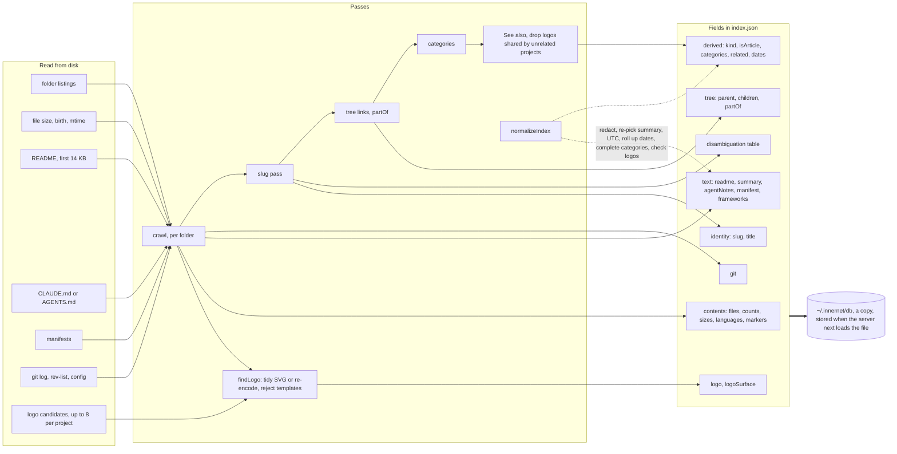
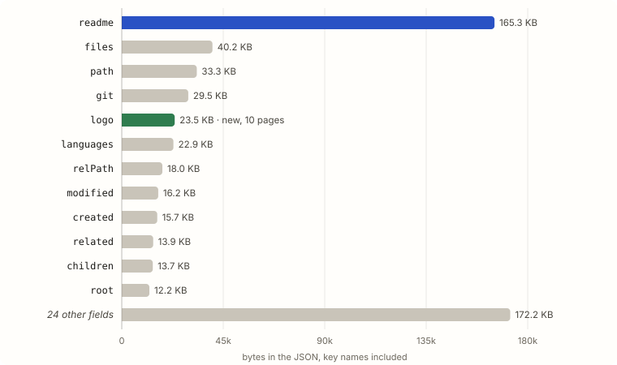
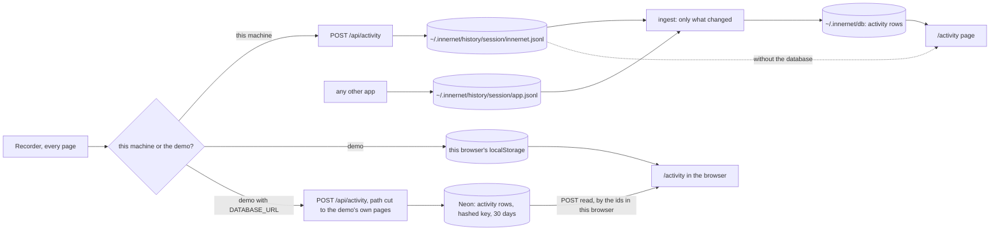
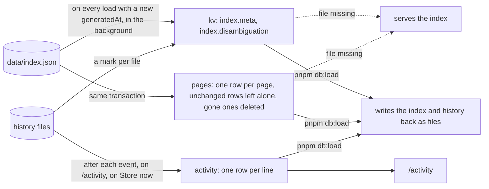
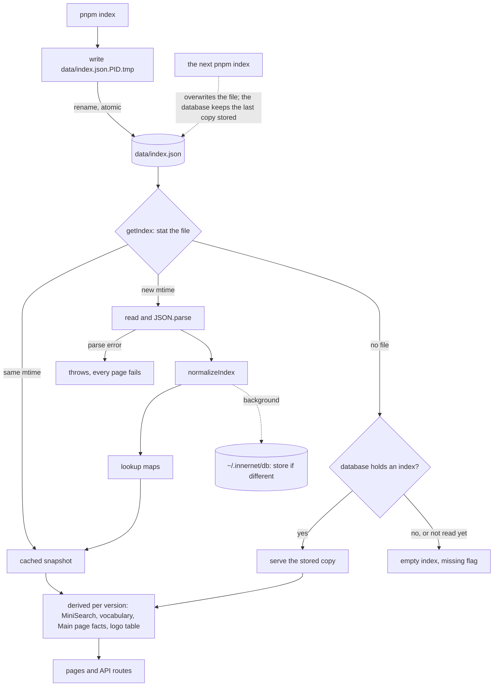

# The *index* and everything else Innernet keeps

*A data inventory for quirq-ai/innernet, read from the code and the committed demo index at commit 4e9bece on 3 October 2026. First written against 735c5be. Companion to the [architecture document](architecture.md).*

> **Snapshot of commit 4e9bece (3 October 2026).** `main` has since merged #32, #34 and #35. Going by their commit messages, they change parts of this document, which has not yet been updated for them:
>
> - **Agents (#34):** dot folders such as `.claude`, `.codex` and `.cursor` are now indexed as agents. Their instruction and memory files (`CLAUDE.md`, `AGENTS.md`, `SOUL.md`, rules, `memory/`) are read, redacted and capped at 8,000 characters each, so statements here that dot folders are never read no longer hold for them.
> - **Sources (#32, #35):** a `/sources` page manages local folders and up to 50 public GitHub repositories from any account, each crawled into its own `data/github-<hash>.json` snapshot.
> - **Remote database (#35):** a Neon database of your own can be connected beside the local PGlite and is kept in step both ways, index and history. Statements here that nothing leaves this machine hold only while no remote database is connected.
> - New modules (`lib/sources.ts`, `lib/storage.ts`, `lib/agents.ts`, `lib/merge-indexes.ts`, `lib/db/remote-sync.ts`, `lib/db/tombstones.ts` and others) are not in the figures, and every line number refers to 4e9bece.

Innernet now keeps three kinds of data. **The index**, `data/index.json`, is what one crawler run learned about your folders: listings, sizes and dates, READMEs, agent notes, manifests, git history, and now each project's logo image. **The history** is every page you open in Innernet, appended to plain JSON Lines files in `~/.innernet/history`. **The database**, an embedded Postgres in `~/.innernet/db`, keeps a copy of both.

None of it leaves the machine. The crawler still reads no source code, documents, `.env` files or keys, and credential-shaped text is redacted when the index is written and again when it is loaded. The public demo is different: it keeps visitors' history in their browsers, and for 30 days in a Neon database when one is configured.

This page lists every field, every store, how each is filled, what is filtered out, how to forget it, and what reaches the network.

| index.json | |
|---|---|
| Shape | { meta, pages[], disambiguation } |
| Contract | lib/types.ts |
| Writer | scripts/build-index.ts |
| Reader | lib/data.ts |
| **On this machine** |  |
| Index | data/index.json |
| History | ~/.innernet/history |
| Database | ~/.innernet/db |
| In git | None of them |
| **Demo** |  |
| Index | 604,139 bytes, 437 pages, committed |
| History | Visitor's browser; Neon for 30 days if set |
| **Lifetime** |  |
| Index | Until the next run; the database copy until you delete it |
| History | Until you delete a session folder |
| Encrypted | No |

<a id="changes"></a>

## What changed since 735c5be

| Change | Data effect | Commit |
|---|---|---|
| Project logos | The crawler now reads the *contents* of up to 8 image files per project and embeds one as a base64 data URI in a new `logo` field, with `logoSurface` | 391f1de |
| Browsing history | Every page opened in Innernet is recorded: kind, path, title or search words, time. Local: files in `~/.innernet/history`. Demo: the visitor's `localStorage` | 391f1de |
| A local database | PGlite in `~/.innernet/db` holds a copy of every index loaded and every history line, including other apps' lines | 4e9bece |
| A demo database | Neon may hold a newer demo index and visitors' history for 30 days, keyed by a hash of the tab's id | 4e9bece |
| Demo index rebuilt | 437 pages (was 408), 12 repositories, 10 logos including the organisation's GitHub avatar, 604 KB (was 547 KB) | 391f1de |


<a id="glance"></a>

## Findings at a glance

Re-run on 4e9bece. D1 is F1 in the architecture document.

| Severity | Finding | Where | Status on 4e9bece |
|---|---|---|---|
| **Medium** | [Folders inside a secret-looking folder are read normally](#d1) | scripts/build-index.ts:796 | Still open, reproduced |
| **Medium** | [Names and counts from the author's local index are published in the film and guide assets](#d2) | public/guide/plates/*.svg | Still open; files unchanged |
| **Low** | [TOML manifests turn config keys into "dependencies"](#d3) | scripts/build-index.ts:161 | Still open, reproduced; still in the demo index |
| **Note** | [The history database takes in whatever any app writes](#d7) | lib/db/ingest.ts:16 | New |
| **Note** | [Search terms travel in the URL, and are now kept as history](#d5) | app/api/activity/route.ts:87 | Updated |
| **Note** | [Commit times keep each author's UTC offset](#d4) | lib/normalize.ts:89 | Still open |

<a id="reads"></a>

## What the crawler reads

Everything `pnpm index` touches, in the order `crawl()` touches it.

| Source | What is taken | Limit | Code |
|---|---|---|---|
| Configuration | `roots` and `maxDepth` from `innernet.config.json`, overridden by `INNERNET_ROOTS`, `INNERNET_MAX_DEPTH`; output path from `INNERNET_OUT` | depth 6 | build-index.ts:28-34 |
| Folder listing | Every entry's name and type. Symlinks are never followed. Pruned folders are listed by name only. | to maxDepth | build-index.ts:748-772 |
| File metadata | Size, birth time and modification time of every non-dot file | all files | build-index.ts:777-784 |
| README | The first `README`, `.md`, `.mdx`, `.markdown`, `.txt` or `.rst`; stored after redaction | 14,000 bytes | build-index.ts:800-802 |
| Agent notes | `CLAUDE.md`, else `AGENTS.md`; the first prose paragraph only | 20,000 bytes read | build-index.ts:803-804 |
| `package.json` | Name, version, description, script names, dependency names | 400,000 bytes | build-index.ts:141-156 |
| `pyproject.toml`, `Cargo.toml` | Name, version, description, a line-based guess at dependencies ([D3](#d3)) | 60,000 bytes | build-index.ts:157-166 |
| `go.mod`, `requirements.txt` | Module name; required package names | 60,000 bytes | build-index.ts:167-176 |
| Marker files | Existence only: `pubspec.yaml`, `Dockerfile`, `foundry.toml`, framework config files | names | build-index.ts:807-816 |
| git, five commands per repository | `log --no-merges -n 6000`, `rev-parse`, `config remote.origin.url`, `rev-list --count`, root commits. Author names, never emails. | 10 s each | build-index.ts:180-226 |
| Logo images **New** | For repositories and projects outside secret folders: files named like `logo`, `icon`, `mark`, `brand`, `favicon` in the project and in `public`, `assets`, `static`, `src`, `.github` and 13 other folder names, up to 3 levels down. The **contents** of the best 8 candidates are read; one is kept, tidied or re-encoded at 160 px. | SVG 64 KB · raster 96 KB | build-index.ts:228-687, 919-926 |
| Below the depth limit | Counts, sizes, dates and languages only | 200,000 files | build-index.ts:703-744 |

**Never read:** source files, documents, notebooks, images other than logo candidates, `.env` and key files, anything inside a dot-folder (except `.github` when looking for a logo), dependency folders or build output, symlink targets, and Innernet's own `data/`. Subfolders of a secret-looking folder are still read normally, which is [D1](#d1); the logo search alone skips them.

<a id="lineage"></a>

## From disk to field



*Fig. 1 Lineage of the index. New: the logo pass (`scripts/build-index.ts:628-668`), `dropSharedDefaults()` (`:671-687`), the logo check in `normalizeIndex()` (`lib/normalize.ts:63-74`) and the database copy (`lib/db/sync.ts:99-133`).*

### The rules that decide a record

| Decision | Rule | Code |
|---|---|---|
| kind | **repo** if a `.git` is present; **project** if a manifest, `pubspec.yaml` or a README of 25 or more words; **docs** if 2 or more files and at least 60% documents; **assets** if mostly media; **code** if named like source (37 names) or half code files; otherwise **folder**. Agent notes promote anything but a repo to project. | build-index.ts:908-916 |
| isArticle | A root, a repo, a project, a docs folder with 4 or more files, or any folder with agent notes | build-index.ts:917 |
| logo **New** | Articles of kind repo or project only. Candidates ranked by name (logo, then icon, mark or brand, then favicon), type, depth and size. SVGs with scripts, `foreignObject`, entities, event handlers or outside links are refused; PNG and ICO must be 32 px or more. Template icons (create-next-app, Expo, React atom) are rejected by hash or colour, and a logo shared by 4 or more unrelated projects is dropped. | build-index.ts:248-687 |
| summary | The README's first prose paragraph of 40 or more letters, cut near 420 characters; else the manifest description; else agent notes that describe | lib/text.ts:79-96 · normalize.ts:55-60 |
| slug and title | A unique name keeps itself; shared names get the shortest unique ancestor qualifier unless one folder is the clear primary topic | build-index.ts:946-1004 |
| categories, related | Unchanged: collections, languages, frameworks, git, docs, Started in *year*, agent-ready, lacking a README, parts of; See also by weighted overlap, top 8 | build-index.ts:1024-1086 |
| created, modified | Earliest birth time (or the latest mtime, if older) and latest mtime in the subtree, widened by a repository's commits, rolled up again on load | build-index.ts:868-905 · normalize.ts:101-107 |

**Review**

<a id="d3"></a>

#### D3. TOML manifests turn config keys into "dependencies"

*Low · Still open*

- **Where:** `scripts/build-index.ts:161-163` takes every `key = value` or quoted array line of `pyproject.toml` or `Cargo.toml`, from any section.
- **Evidence:** The rebuilt demo index still lists the `wiki` repository's dependencies as `requires, build-backend, dependencies, dev, quirq-wiki, include, testpaths, addopts`. Re-run on 4e9bece: a test `pyproject.toml` gave `dependencies, fastapi, httpx, requires, build-backend, testpaths`; a test `Cargo.toml` gave `homepage, repository, serde, tokio, lto`.
- **Fix:** Track the current `[section]` and keep names only inside the dependency sections.

<a id="file"></a>

## The index file

```
interface SiteIndex {
  meta: IndexMeta;                 // when, where from, how many
  pages: Page[];                   // one record per indexed folder
  disambiguation: Record<string, { primary: string | null; slugs: string[] }>;
}
```

| meta field | Holds | Demo value |
|---|---|---|
| generatedAt | ISO time the run started | 2026-10-03T02:48:30.236Z |
| roots | Label and absolute path of each root (your home folder, locally) | github.com/quirq-ai |
| maxDepth, deeperCounted | Depth limit; whether folders past it were tallied | 6 · true |
| counts | pages, articles, repos, stubs, categories | 437 · 73 · 12 · 364 · 28 |
| durationMs | How long the run took | 32,104 |
| demo | Demo only: the organisation and each repository's name, URL, branch, fork flag, description | 12 repositories |

The demo has 98 shared names, 15 with a primary topic. `docs` now names 13 folders; `assets` names 4 with none primary, so `/wiki/assets` is the list itself.

<a id="fields"></a>

## Every field of a page

All 36 fields of `Page`. "Demo" counts the 437 demo pages with a non-empty value, where that varies.

| Field | Type | Holds and how | Demo | Used by |
|---|---|---|---|---|
| **Identity** |  |  |  |  |
| slug | string | Unique wiki address | 437 | Every link, search id |
| name, title | string | Folder name; display title with qualifier | 437 | Search (weights 6 and 3), headings |
| path | string | Absolute path on disk; a GitHub URL in the demo | 437 | Open in VS Code, View on GitHub |
| relPath, root, depth | string, number | Path below its root, root label, depth | 437 | Breadcrumbs, `in:`, ranking |
| **Tree** |  |  |  |  |
| parent | slug \| null | Enclosing folder | 436 | Breadcrumbs |
| children | slug[] | Indexed subfolders | 145 | Structure |
| partOf | slug \| null | Nearest enclosing project | 420 | "Part of", ranking, categories |
| hiddenChildren, deeper | string[], object? | Pruned subfolder names; what lies past the depth limit | 12 · 3 | Structure |
| **Contents** |  |  |  |  |
| files | string[] | Up to 24 direct file names, secret-looking ones removed | 396 | Structure, stub text |
| fileCount, totalFiles, bytes, totalBytes | number | Direct and subtree counts and sizes | all | Infobox, Statistics |
| docFiles, languages, markers | number, list | Document count; top 8 languages; detected marker files | 127 · 393 · varies | Documents tab, Technology, kind |
| **Text and images quoted from the folder** |  |  |  |  |
| readme, readmeFile, words | markdown, string, number | README text, redacted, at most 14,000 bytes | 30 | Overview, snippets, search |
| summary | string \| null | One paragraph, at most 420 characters | 29 | Lead, snippets, knowledge panel |
| agentNotes | string \| null | First paragraph of CLAUDE.md or AGENTS.md | 2 | Search, snippets |
| manifest, frameworks | object, string[] | Name, version, description, scripts, dependency names; detected frameworks | 11 · 8 | Infobox, Technology, `fw:` |
| logo **New** | data URI \| null | The project's own mark as `data:image/…;base64`, at most 140,000 characters | 10 | Every sigil, the globe, suggestions, through `/api/logo/<hash>` |
| logoSurface **New** | enum \| null | `dark`, `light` or `none`: the tile the logo wants, read from its colours | 8 | Tile background |
| **Git, repositories only** |  |  |  |  |
| git.branch, remote | string \| null | Current branch; origin URL without any login | 12 | Infobox |
| git.commitCount, authorCount, first and lastCommit | number, ISO | Commits without merges; distinct author names; first and newest commit | 12 | Infobox, History, Statistics |
| git.recent, authors, monthly, onThisDay | lists | 15 newest commits with author names; 8 most active authors; 24 months; commits on the index date | 12 | History, Main page |
| **Derived** |  |  |  |  |
| kind, isArticle | enum, boolean | See the rules above | 73 articles | Tabs, `kind:`, `is:` |
| categories, related | string[], slug[] | Articles only; See also up to 8 | 73 · 70 | Category pages, See also |
| created, modified | ISO, UTC | Rolled up from the subtree and git | 437 | Recency, "updated 3 days ago" |

<a id="sample"></a>

## A real record

The `innernet` page from the rebuilt demo index, shortened. Author names are left out here. The demo index was built before the two new commits, so it describes the repository at 735c5be.

```
{
  "slug": "innernet", "name": "innernet", "title": "innernet",
  "path": "https://github.com/quirq-ai/innernet",   // a local path outside the demo
  "relPath": "innernet", "root": "github.com/quirq-ai", "depth": 1,
  "kind": "repo", "isArticle": true, "parent": "quirq-ai", "partOf": null,
  "children": ["app_(innernet)", "brand_(innernet)", "components_(innernet)", "data_(innernet)", …],
  "files": ["CONTRIBUTING.md", "DESIGN.md", "innernet.config.json", "next.config.ts", …],
  "fileCount": 10, "totalFiles": 272, "bytes": 110390, "totalBytes": 102213253,
  "created": "2026-10-02T18:06:48.000Z", "modified": "2026-10-02T23:38:50.000Z",
  "languages": [{ "name": "TypeScript", "files": 89 }, { "name": "JavaScript", "files": 47 }, …],
  "frameworks": ["Next.js", "React", "Tailwind CSS"],
  "summary": "Innernet turns the folders on your machine into a small, connected web. …",
  "readme": "…", "words": 865,                     // up to 14,000 bytes of markdown
  "logo": "data:image/svg+xml;base64,PHN2ZyB4bWxucz…",   // new: 1,118 characters, the app's icon
  "git": {
    "branch": "main", "remote": "https://github.com/quirq-ai/innernet", "commitCount": 9,
    "recent": [{ "hash": "735c5be", "date": "2026-10-03T05:08:50+05:30",   // author's own offset, D4
                 "author": "name", "subject": "feat: a public demo of Innernet that runs on Vercel" }, …],
    "authorCount": 1, "monthly": [ … { "month": "2026-10", "count": 9 }]
  },
  "categories": ["TypeScript projects", "Next.js", "React", "Tailwind CSS", "Git repositories", "Started in 2026"],
  "related": ["quirq_ai", "quitter", "docs", "instants", "environment", ".github", "galileo"]
}
```

<a id="size"></a>

## Where the bytes go

Measured on the rebuilt demo index. README text is still the largest field, 28% of page data. Logos are new and already the fifth largest, from 10 pages.



*Fig. 2 Bytes per field across all 437 pages of `data/demo/index.json`, key names included; 1 KB is 1,000 bytes. The organisation's avatar alone is 11.8 KB of the 23.5 KB of logos. Outside the pages: 10.4 KB of disambiguation and 1.7 KB of metadata.*

| Kind | Articles | Stubs |
|---|---|---|
| code | 0 | 219 |
| folder | 1 | 96 |
| docs | 43 | 15 |
| assets | 0 | 34 |
| project | 17 | 0 |
| repo | 12 | 0 |
| **All**, depths 0 to 6: 1, 12, 75, 107, 120, 86, 36 | **73** | **364** |

<a id="rules"></a>

## Filtering and redaction

| Layer | Rule | Code |
|---|---|---|
| Not walked | 35 named folders (`node_modules`, `.git`, `dist`, `build`, `target`…), dot-folders, app bundles, Python virtual environments, symlinks, Innernet's own `data/` | build-index.ts:42-48, 105-106 |
| Not listed | 21 file-name patterns: `.env*`, keys, certificates, anything with secret, credential, token, password or cookie in the name | lib/normalize.ts:16-21 |
| Not read | A folder named like `cred`, `secret`, `private` or `keys`: no files, README, notes, manifest or logo for that folder; its subfolders still crawled (D1) | build-index.ts:50, 796-805 |
| Rewritten | `redactSecrets()`: PEM keys, URL passwords, nine vendor key formats, JWTs, bearer values, and high-entropy values next to secret-sounding names | lib/text.ts:113-193 |
| Logos **New** | SVGs tidied and refused if they could act or reach out; rasters decoded and re-encoded; checked again on load (`cleanLogo`) and before serving (`logoById`); demo SVGs decoded and leak-checked | build-index.ts:499-525 · normalize.ts:63-74 · logo.ts:48-58 |
| History text **New** | Control and formatting characters removed; titles 200 characters, searches 300 (120 and 120 on the demo); paths must be this app's own; the demo keeps only `q`, `t` and `p` of a query | components/activity/shared.ts:130-178 |

**Review**

<a id="d1"></a>

#### D1. Folders inside a secret-looking folder are read normally

*Medium · Still open*

- **Where:** `scripts/build-index.ts:796-805` withholds the folder's own files, but its subfolders are crawled (`:874-878`) and git is read (`:859`). The new logo search checks every ancestor (`:920`), so the fix already exists in the same file.
- **Evidence:** Re-run on 4e9bece: `credentials/aws` still listed `accounts.csv` and `README.md` with its README as summary; `private-keys/prod` still had its manifest parsed.
- **Fix:** Apply the logo search's ancestor test to the whole crawl: count what lies below a secret folder with `tally()` and skip `gitInfo()`.

<a id="history"></a>

## The history **New**

A recorder mounted in the root layout turns every route change into one event. One session per browser tab; its id is the tab's start time plus a random tail.



*Fig. 4 Where an event goes. The files are the record; the database follows them (`lib/db/ingest.ts:16-42`).*

| Field | Holds | Local | Demo server |
|---|---|---|---|
| at | Time of the event | Server time on write | Server time |
| app | Who wrote it: the file's name | `innernet`, or any app's own file | `innernet` only |
| kind | `visit`, `search`, `back`, `forward` | Innernet's four; other apps any short verb | The four |
| url | The page's path | Path and full query | One of the demo's own pages; query only `q`, `t`, `p` |
| title | The page title, for visits | 200 characters | 120 characters |
| q | The search words, for searches | 300 characters | 120 characters |
| via | How a back or forward happened | `buttons` or `browser` | Same |

**Not recorded:** reloads of the same page, automated browsers (`navigator.webdriver`), and on the demo any IP address, user agent, cookie or header. **In the tab:** `sessionStorage` holds `innernet-session` (the id) and `innernet-trail` (up to 100 pages for back and forward). **On the demo, in the browser:** `localStorage` holds `innernet-history` (40 sessions of 400 events) and `innernet-history-sent` (up to 1,000 ids sent to the server, for 31 days).

**Review**

<a id="d7"></a>

#### D7. The history database takes in whatever any app writes

*Note · New*

- **Where:** `lib/db/ingest.ts:16-42` reads every `*.jsonl` in every session folder into PGlite; `/activity` shows them. A line needs only a time and a kind, up to 4 KB, with any other fields.
- **Why:** That openness is the point, and the README invites it. It also means Innernet's database and history page hold whatever a terminal logger, a browser extension or a script chooses to write, under the same folder permissions. Worth one sentence in the privacy chapter: what Innernet stores is no longer only what Innernet collects.

<a id="database"></a>

## The database **New**

The same three tables in both databases (`lib/db/schema.ts:18-32`). Plain SQL, no ORM.

| Table | Columns | On this machine (PGlite) | On the demo (Neon) |
|---|---|---|---|
| kv | key, value jsonb, updated_at | `index.meta`, `index.disambiguation`, a mark per history file (bytes read, inode, mtime, hash), the folder's identity, sessions kept after the folder was replaced | `index.meta`, `index.disambiguation`, daily write and read counters |
| pages | slug, pos, data jsonb, updated_at | Every page of the last index loaded, README text and absolute paths included | A demo index stored by `pnpm db:store --demo`, after leak checks |
| activity | uid, session, app, at, kind, data jsonb, line | Every history line from every app; `uid` hashes session, app and the exact line, which is also kept | Visitors' events; `session` is a hash of the tab's id; `line` left empty |



*Fig. 5 Where the local database's rows come from and where they go (`lib/db/index-store.ts:31-84`, `lib/db/ingest.ts`, `scripts/db.ts`). One process holds the folder at a time (`owner.lock`); a second server runs on files alone. After a few hundred rows change, PGlite is vacuumed and checkpointed (`lib/db/schema.ts:68-79`).*

<a id="demo"></a>

## The demo

| Step | Data | Code |
|---|---|---|
| List repositories | GitHub REST API with no token; archived, disabled and empty repositories skipped | build-demo-index.ts:62-90 |
| Clone | Default branch, last 300 commits, blobless, no credentials or git config | build-demo-index.ts:117-167 |
| Date folders | One `git log --name-only` per repository | build-demo-index.ts:190-226 |
| Crawl | The ordinary crawler, logos included | build-demo-index.ts:284-292 |
| Organisation avatar **New** | `github.com/quirq-ai.png`, fetched once, anonymously, as JPEG or PNG under 96 KB, embedded as the root's logo; the last one is kept if GitHub does not answer | build-demo-index.ts:94-113 |
| Rewrite | Paths become github.com URLs; the org profile becomes the root README | build-demo-index.ts:294-385 |
| Check, or refuse to write | No machine path anywhere, SVG logos decoded and checked too; every repository still public | build-demo-index.ts:390-465 |
| Into Neon **New** | `pnpm db:store --demo` runs `demoIndexProblems()` again; the server runs it once more before serving Neon's copy | lib/demo-check.ts · lib/db/sync.ts:227 |

Visitor history on the demo server: 400 events per session, 10,000 stored across the demo per UTC day, 50,000 read per day, at most 1,000 rows per read, nothing once the table passes 300 MB, and nothing older than 30 days served or kept (`lib/db/demo-history.ts:38-59`).

<a id="lifecycle"></a>

## Lifecycle and forgetting



*Fig. 3 From write to render. The database branch is new (`lib/data.ts:99-108`, `lib/db/sync.ts:146-193`). The parse-error branch is F3 in the architecture document: a corrupt file still fails before the stored copy is tried.*

### How to forget

| To forget | Delete | Then |
|---|---|---|
| The index | `data/index.json` *and* `~/.innernet/db` | Deleting the file alone makes the server serve the database copy, by design |
| One browsing session | Its folder in `~/.innernet/history` | The database forgets it on its next pass (an event, a visit to `/activity`, or Store now) |
| All history | `~/.innernet/history` and `~/.innernet/db` | Deleting only the folder makes the database keep its sessions for `pnpm db:load`, because it looks like a replaced folder |
| Everything | `data/index.json`, `~/.innernet`, `.next` | The README says the same (README.md:222-223) |
| Demo history | Clear on `/activity` | Deletes this browser's sessions from Neon by id, then from `localStorage` |
| No database at all | Set `INNERNET_DB=off` | Innernet reads and writes its files alone |

**Review**

<a id="d4"></a>

#### D4. Commit times keep each author's UTC offset

*Note · Still open*

- **Where:** `lib/normalize.ts:89-91` converts `firstCommit` and `lastCommit` to UTC; `git.recent[].date` and `git.onThisDay[].date` keep git's `%aI` offset.
- **Evidence:** The rebuilt demo index: `"date": "2026-10-03T05:08:50+05:30"` on `innernet`'s newest commit.
- **Fix:** Run `utc()` over both commit lists, or keep the offset on purpose and say so in `lib/types.ts`.

<a id="stores"></a>

## Every store

Everywhere Innernet, its tools or its host keep something.

| Where | What | Who can see it | How long |
|---|---|---|---|
| data/index.json | The local index | Local, gitignored | Until the next run |
| data/*.tmp | A half-written index during a run | Local | Renamed at the end of the run |
| ~/.innernet/history | Every page opened, one folder per tab; other apps' lines | Local, folders 0700, files 0600 | Until deleted |
| ~/.innernet/db | Copies of the last index and of every history line; file marks; `owner.lock` | Local, folder 0700 | Until deleted; follows the history folders |
| .demo-cache/ | Clones of the public repositories | Local, gitignored | Until deleted |
| data/demo/index.json | The demo index | Everyone | Per commit |
| Neon (demo) | A newer demo index; visitors' history under hashed keys | The project owner | History 30 days |
| Server memory | Index, lookup maps, search engine, logo table, sync and database state | The server process | Until it exits |
| Server log | `[innernet db]` lines: what was stored, from where, page and line counts | Whoever reads the terminal or Vercel's logs | The log's own retention |
| Browser `localStorage` | `innernet-theme`; on the demo also `innernet-history`, `innernet-history-sent` | That browser | Until cleared |
| Browser `sessionStorage` | `innernet-session`, `innernet-trail` | That tab | Until the tab closes |
| .next/dev/trace | Request URLs, search queries included, in development | Local, gitignored | Until deleted |
| Hosting logs, demo | Request URLs with search terms | Vercel and the owner | Vercel's retention |
| .env.neon.local · .vercel | The Neon connection string, for `--demo` commands | Local, gitignored and kept out of CLI uploads | Until deleted |
| film/ · public/guide/plates/ | Folder names and counts from the author's local index | Everyone | Committed; D2 |

**Review**

<a id="d2"></a>

#### D2. Names and counts from the author's local index are published in the film and guide assets

*Medium · Still open*

- **Where:** `film/storyboard.html` (written by `film/scripts/sheet.mjs:21-25` from `data/index.json`), `film/assets/captures/*.png`, and seven of nine `public/guide/plates/*.svg`. None changed in the two new commits.
- **Why:** The plates are now drawn on the home page itself, since the field guide moved there, so every demo visitor's first page carries them. The demo's leak checks still cover only the index.
- **Fix:** If the names should not be public, regenerate the plates and sheet from the demo index and extend the leak check to `public/guide/` and `film/`.

<a id="leaves"></a>

## What leaves the machine

At run time on your machine, still nothing: the CSP is unchanged, every new request is to this app, and local mode refuses Neon in code (`lib/db/neon.ts:16`). Everything below is build time, the demo, or a link you click.

| Flow | When | What is sent | To |
|---|---|---|---|
| Fonts | First dev run or build | Font requests by `next/font` | Google Fonts |
| Repository list, clones | `pnpm index:demo` | Anonymous requests | api.github.com · github.com |
| Organisation avatar | `pnpm index:demo` | One anonymous image request | github.com · avatars.githubusercontent.com |
| Demo index to Neon | `pnpm db:store --demo` | The demo index, after leak checks | Neon |
| Demo deployment | Push and build | The demo index, guide sources and plates, the 720p film | Vercel, public |
| Demo history | Every page a visitor opens, when `DATABASE_URL` is set | Kind, demo path, title or search words; server stores a hashed session key and its own time | Neon, 30 days |
| Ask an AI | Only when clicked | A fixed prompt about the repository; nothing from the index or the visitor | claude.ai · chatgpt.com · grok.com |
| Narration | Film tooling | Narration text and audio | api.elevenlabs.io |
| Film and guide assets | `git push` | Local folder names (D2) | GitHub, public |

**Review**

<a id="d5"></a>

#### D5. Search terms travel in the URL, and are now kept as history

*Note · Updated*

- **Where:** `/search?q=` and `/api/suggest?q=` are GET requests; every search is also recorded as a `search` event with `q` (`app/api/activity/route.ts:87`).
- **Why:** Locally, search words now live in the history files and the database until deleted, beside browser history and `.next/dev/trace`. On a demo with a database they live in Neon for 30 days, cut to 120 characters. The guide's privacy chapter says so; this is for completeness.

<a id="checks"></a>

## Checks run

On 4e9bece, in a scratch folder, with the database and history directories pointed there. Nothing was committed.

```
# sizes, coverage, kinds, logos and disambiguation of the rebuilt demo index
node -e '…' over data/demo/index.json

# D1 and D3: the same test trees as before, indexed with the new crawler
INNERNET_ROOTS=/tmp/sec/root INNERNET_OUT=/tmp/sec/out.json pnpm index
INNERNET_ROOTS=/tmp/toml/root INNERNET_OUT=/tmp/toml/out.json pnpm index

# the database copy: stored on load, served when the file was deleted
INNERNET_DB_DIR=/tmp/t/db tsx --conditions=react-server check.mts
```

**Not examined:** a real local index or history (none exists in this checkout), the PNG and ICO decoders, and Neon itself.

*Every number on this page was read from data/demo/index.json at commit 4e9bece, or from the code beside it. First written at 735c5be.*
