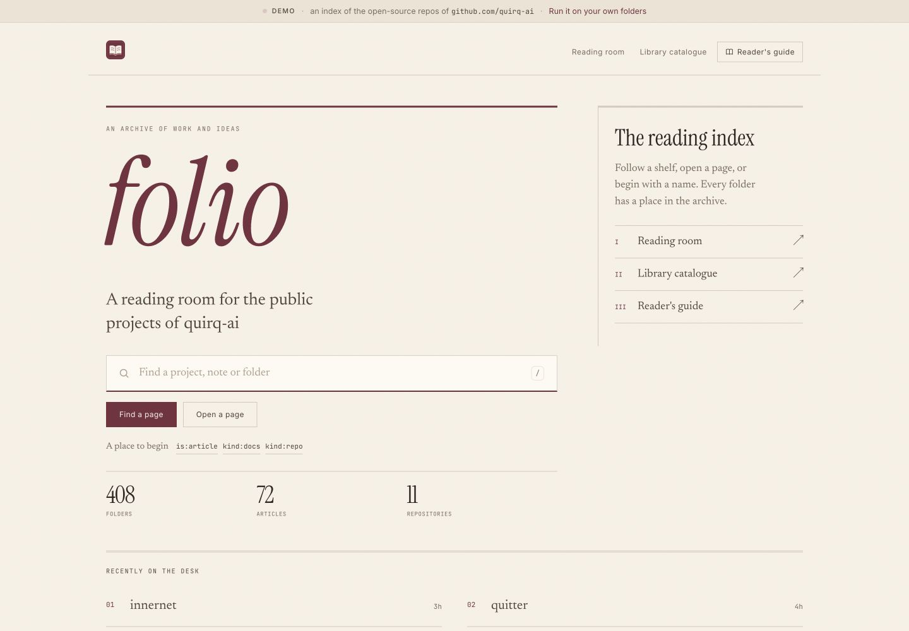
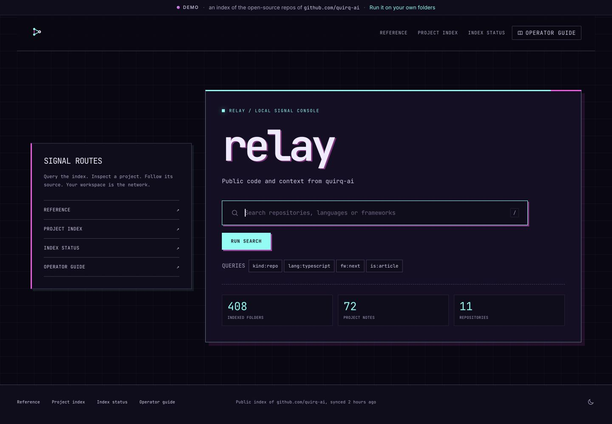
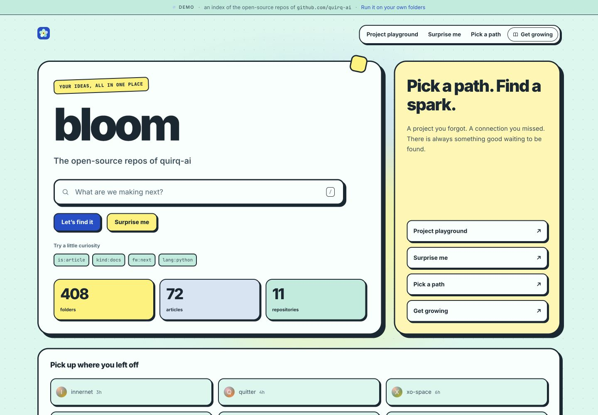

# UI templates

Choose a starting point for your personal internet. Each template is a partial JSON
override with its own identity, local header artwork, browser icons and light/dark
palettes. They also choose a home composition and shared control style. Templates use
the same engine and index.

| Template | Vibe | Typography | Starting theme |
| --- | --- | --- | --- |
| [atlas](atlas.ui.json) | Quiet green project atlas, compact and practical. | System sans | System |
| [folio](folio.ui.json) | Editorial archive: oversized serif cover, reading index, paper and oxblood, square ruled controls. | Instrument Serif and Newsreader | Light |
| [relay](relay.ui.json) | Cyberpunk console: neon cyan and magenta, grid, angular HUD panels and technical type. | JetBrains Mono and Inter | Dark |
| [bloom](bloom.ui.json) | Playful workspace: mint and cobalt bento cards, yellow accents, chunky outlines and offset shadows. | Inter and Newsreader | Light |

## Previews

These previews use the same committed public index. folio is shown in light mode,
relay in dark mode, and bloom in light mode. Each also supports the other theme.

| folio | relay | bloom |
| --- | --- | --- |
|  |  |  |

| Template | Other desktop theme | Phone: light | Phone: dark |
| --- | --- | --- | --- |
| folio | [Dark](../docs/ui/templates/folio-dark.png) | [Preview](../docs/ui/templates/folio-mobile-light.png) | [Preview](../docs/ui/templates/folio-mobile-dark.png) |
| relay | [Light](../docs/ui/templates/relay-light.png) | [Preview](../docs/ui/templates/relay-mobile-light.png) | [Preview](../docs/ui/templates/relay-mobile-dark.png) |
| bloom | [Dark](../docs/ui/templates/bloom-dark.png) | [Preview](../docs/ui/templates/bloom-mobile-light.png) | [Preview](../docs/ui/templates/bloom-mobile-dark.png) |

## Use a template

Run from the repository root, replacing `folio` with any template name:

```bash
INNERNET_UI_CONFIG=examples/folio.ui.json pnpm dev
```

To preview the public repository index instead of your local folders:

```bash
INNERNET_UI_CONFIG=examples/folio.ui.json pnpm dev:demo
```

Choose light, dark or system with the theme control. A saved reader preference takes
precedence over a template's starting theme.

Copy a template and edit its JSON to make it yours. Objects merge with the defaults;
arrays replace them, so you can change navigation order and page sections. Keep the
`$schema` path relative to your new file. Put replacement artwork in `public/` and
point the logo and icon fields at its local URL.

Change `theme.style` (`classic`, `editorial`, `cyberpunk`, `playful`) and `home.layout`
(`centered`, `editorial`, `console`, `bento`) independently. The presets pair them for
their intended character; you can mix a composition with different palettes or control
styles. All choices are schema-validated. The default innernet layout stays centered.

Saved JSON changes appear on the next full page load. Restart the server when
switching the `INNERNET_UI_CONFIG` path. There is no need to rebuild your folder index.
For a deployment, set the same repository-relative override path at build time and
runtime so its JSON file is included in the server bundle.

These presets replace the default publisher and source links and hide the footer
credit. The public demo still identifies its actual source, github.com/quirq-ai, and
indexed project names and content keep their original identity. The default innernet
theme continues to use the approved quirq artwork.

See the [UI customization guide](../docs/ui/README.md#customization) for the supported
settings, schema and asset requirements. Run `pnpm check:ui` to validate every template
and check that its bundled artwork exists.
